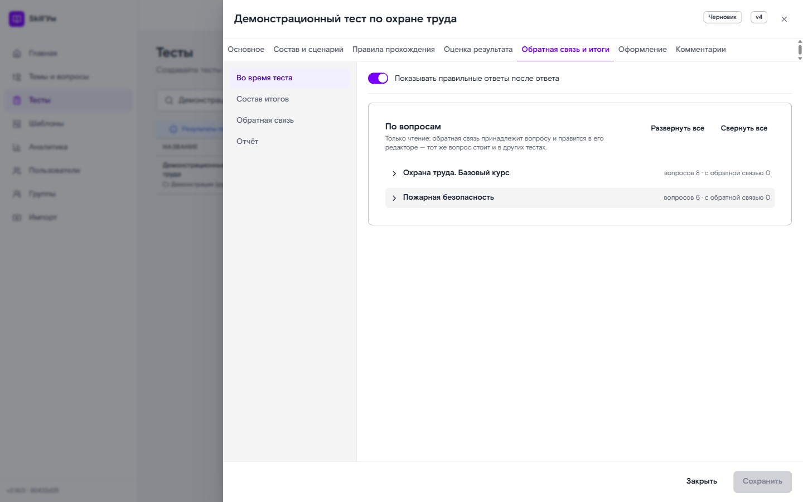
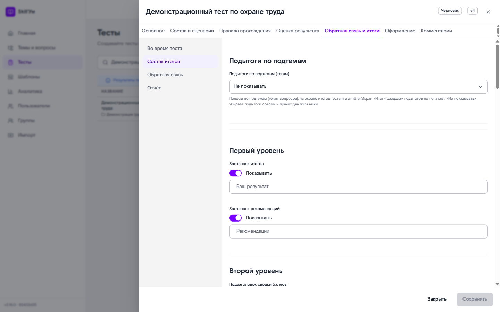
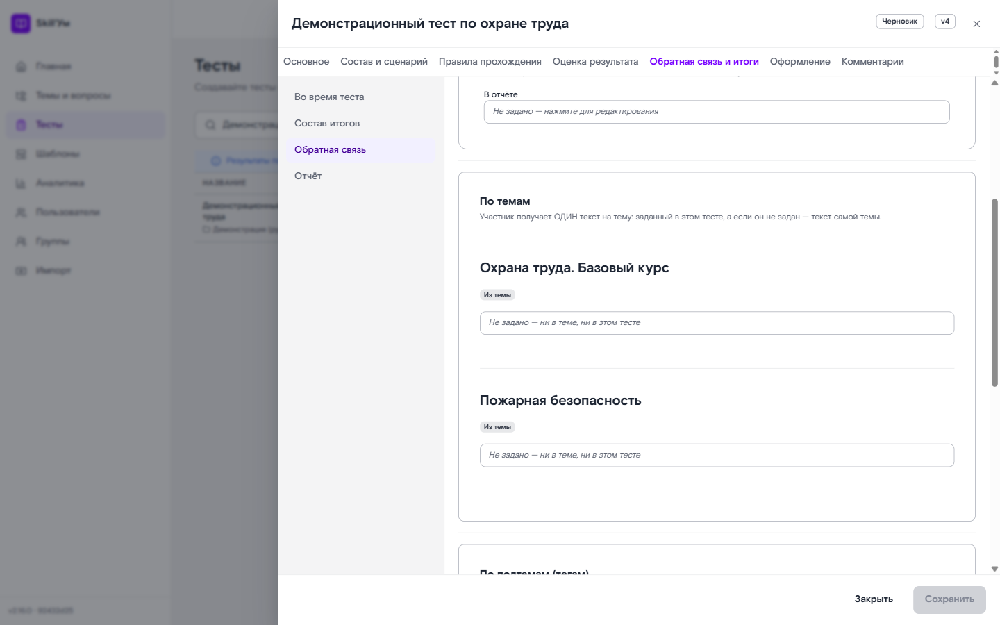

# Как создать тест в Skill'Ум. Руководство автора

Это руководство для человека, которому поручили сделать тест в Skill'Ум. Оно проводит
через весь путь: от первой темы и первого вопроса до опубликованного теста, выданного
ученикам или выгруженного в LMS.

Читать подряд не обязательно. Если нужно просто получить работающий тест как можно
быстрее, хватит раздела «Быстрый старт»: он ведёт по кратчайшему маршруту и занимает
около пятнадцати минут. Все остальные разделы — подробный разбор того, что вы там
пролистнули.

## Содержание

- [Быстрый старт](#быстрый-старт)
- [1. Что нужно знать до начала](#1-что-нужно-знать-до-начала)
- [2. Ориентируемся в интерфейсе](#2-ориентируемся-в-интерфейсе)
- [3. Тема — папка для вопросов](#3-тема--папка-для-вопросов)
- [4. Вопросы](#4-вопросы)
- [5. Массовая загрузка вопросов из Excel](#5-массовая-загрузка-вопросов-из-excel)
- [6. Создаём тест](#6-создаём-тест)
- [7. Вкладка «Основное»](#7-вкладка-основное)
- [8. Вкладка «Состав и сценарий»](#8-вкладка-состав-и-сценарий)
- [9. Вкладка «Правила прохождения»](#9-вкладка-правила-прохождения)
- [10. Вкладка «Оценка результата»](#10-вкладка-оценка-результата)
- [11. Вкладка «Обратная связь и итоги»](#11-вкладка-обратная-связь-и-итоги)
- [12. Вкладка «Оформление»](#12-вкладка-оформление)
- [13. Вкладка «Комментарии»](#13-вкладка-комментарии)
- [14. Проверка: отладочный прогон](#14-проверка-отладочный-прогон)
- [15. Публикация](#15-публикация)
- [16. Выдача ученикам](#16-выдача-ученикам)
- [17. Аналитика](#17-аналитика)
- [18. Частые ошибки и что они значат](#18-частые-ошибки-и-что-они-значат)
- [19. Чек-лист перед публикацией](#19-чек-лист-перед-публикацией)
- [20. Что читать дальше](#20-что-читать-дальше)

---

## Быстрый старт

Маршрут для первого теста: одна тема, пять вопросов, простые настройки, публикация.
Всё, что не упомянуто здесь, имеет разумное значение по умолчанию и может подождать.

### Шаг 1. Войдите в сервис

Откройте адрес сервиса и войдите под своей учётной записью. Если у вас есть право
создавать тесты, в левом меню будут пункты «Темы и вопросы» и «Тесты».

### Шаг 2. Создайте тему

Тема — это папка, в которой лежат вопросы. Тест сам вопросов не хранит: он берёт их
из тем.

1. Откройте «Темы и вопросы».
2. Нажмите круглую кнопку «Создать» в правом нижнем углу и выберите «Добавить тему».
3. Введите название, например «Охрана труда. Базовый курс», и сохраните.

### Шаг 3. Добавьте пять вопросов

1. Той же кнопкой «Создать» выберите «Добавить вопрос».
2. Укажите тему, выберите тип «Один ответ», напишите текст вопроса.
3. Заполните варианты ответа и отметьте верный.
4. Сохраните и повторите ещё четыре раза.

Дальше можно не читать про типы вопросов: одиночного выбора достаточно, чтобы тест
заработал.

### Шаг 4. Создайте тест

1. Откройте «Тесты».
2. Нажмите круглую кнопку «Создать», выберите папку (можно «Корень») и нажмите
   «Создать тест».
3. Откроется ящик редактора. На вкладке «Основное» заполните «Название» — это
   единственное обязательное поле.

### Шаг 5. Наберите состав

1. Перейдите на вкладку «Состав и сценарий», подраздел «Состав».
2. Нажмите «Добавить тему» и выберите созданную тему.
3. В строке темы задайте «Вопросов в тест» — например 5.
4. Нажмите «Сохранить» внизу ящика.

Тест уже рабочий: остальные вкладки заполнять не обязательно.

### Шаг 6. Прогоните тест сами

В списке тестов нажмите на строке кнопку «Выполнить отладку». Откроется отдельное
окно, где тест проходится ровно так, как его увидит ученик, но без записи попытки.
Пройдите его до конца и посмотрите на экран итогов.

### Шаг 7. Опубликуйте

В меню теста (три точки в строке) выберите «Опубликовать». Тест получает статус
«Опубликован» и становится доступен для выдачи.

Дальше — либо «Назначить» (выдать тест людям внутри сервиса), либо «Экспорт SCORM»
(получить ZIP-пакет для загрузки в LMS). Обе кнопки описаны в разделе
[«Выдача ученикам»](#16-выдача-ученикам).

---

## 1. Что нужно знать до начала

### 1.1. Пять слов, которые встречаются везде

**Вопрос** — одно задание. Живёт в общем банке и может использоваться сразу в
нескольких тестах.

**Тема** — папка, в которой лежат вопросы. Существует независимо от тестов.

**Раздел (состав теста)** — тема, включённая в конкретный тест. Раздел решает,
сколько вопросов из темы получит ученик и какой порог нужно взять.

**Выдача** — сколько вопросов темы реально увидит ученик. Если в теме 40 вопросов, а
в разделе указано «Вопросов в тест: 10», каждый ученик получит случайные 10 из 40.
Это делает попытки разными и защищает банк от переписывания.

**Балл и порог** — сколько очков приносит верный ответ и сколько очков нужно набрать,
чтобы раздел или тест считался сданным.

### 1.2. Цена вопроса принадлежит тесту, а не вопросу

Это правило удивляет чаще всего. Один и тот же вопрос может стоить 1 балл во вводном
тесте и 3 балла в сертификационном. Поэтому в карточке вопроса поля «Баллы» нет —
цена задаётся на вкладке «Оценка» внутри теста. Подробнее — в разделе
[«Оценка результата»](#101-оценка-ответа).

### 1.3. Роли: что вам доступно

Права выдаются ролями, у одного человека их может быть несколько, а итоговые права —
объединение всех.

| Роль | Что может по части тестов |
| --- | --- |
| Автор | Темы, вопросы, тесты, публикация, отладочный прогон, аналитика |
| Разработчик | Всё то же плюс выгрузка SCORM и управление шаблонами оформления |
| Менеджер обучения | Назначение тестов, группы, пользователи, аналитика |
| Администратор | Всё, кроме двух системных настроек суперпользователя |
| Обучающийся | Проходить назначенные тесты и смотреть свои результаты |

Из этой таблицы следуют два практических вывода.

- Кнопки «Экспорт SCORM» у автора нет — выгрузку в LMS делает разработчик или
  администратор. Отладочный прогон при этом автору доступен.
- Кнопки «Назначить» у автора тоже нет — выдачей людям занимается менеджер обучения
  или администратор.

Поверх ролей действует область видимости: свои тесты и темы вы видите всегда, чужие —
только если вам выдали доступ.

---

## 2. Ориентируемся в интерфейсе

Слева — постоянное меню. В нём показываются только те пункты, на которые у вас есть
право, поэтому список может быть короче приведённого.

| Пункт меню | Зачем нужен |
| --- | --- |
| Главная | Рабочий стол: что вас ждёт, ваши тесты, материалы |
| Темы и вопросы | Единое дерево «Папка → Тема → Вопрос» — весь банк содержимого |
| Тесты | Дерево тестов по папкам, редактор теста, публикация, выдача |
| Шаблоны | Реестр шаблонов оформления (для разработчика и администратора) |
| Аналитика | Сводка по попыткам и результатам |
| Пользователи, Группы | Учётные записи и группы для назначения |
| Импорт | Загрузка книги Excel с вопросами и настройками |

---

## 3. Тема — папка для вопросов

Откройте «Темы и вопросы». Это одно дерево: папки, внутри них темы, внутри тем —
вопросы. Колонки справа показывают тип и сложность вопроса и количество вопросов в
теме.

Круглая кнопка «Создать» в правом нижнем углу разворачивается в три действия:
«Добавить папку», «Добавить тему», «Добавить вопрос».

### 3.1. Свойства темы

Щелчок по строке темы разворачивает и сворачивает её вопросы. Чтобы открыть саму тему,
нажмите кнопку с тремя точками в конце строки и выберите «Настройки темы…» (или
«Доступ…», чтобы попасть сразу на вторую вкладку). Вкладка «Свойства»:

- **Название темы** — обязательное. Сервис проверяет, нет ли уже темы с таким
  названием, и предупреждает: одинаковые названия потом путают при наборе состава.
- **Id (код)** — короткий код темы. Нужен, чтобы ссылаться на тему в формулах
  показателей результата коротко и читаемо. Если показателями вы не пользуетесь, поле
  можно не заполнять.
- **Описание** — свободный текст для себя и коллег.
- **Обратная связь темы** — текст, который увидит ученик по итогам этой темы.
  Редактируется тем же редактором, что и обратная связь теста: можно задать разные
  тексты для разных исходов.

### 3.2. Доступ к теме

Вкладка «Доступ» появляется у уже созданной темы.

- **Владелец** — кто отвечает за тему; меняется кнопкой «Сменить владельца».
- **Общая тема** — переключатель видимости. Общая тема видна всем авторам; приватная —
  только владельцу, получателям грантов и администратору.
- **Гранты доступа** — выбираете человека, уровень («Просмотр» — можно брать тему в свои
  тесты, «Управление» — можно править содержимое) и нажимаете «Добавить».

Отзыв доступа предлагает два режима: полный отзыв и отзыв с сохранением уже собранных
тестов. Второй нужен, чтобы не сломать чужой опубликованный тест, который опирается на
вашу тему.

---

## 4. Вопросы

Новый вопрос создаётся кнопкой «Создать» → «Добавить вопрос». Существующий открывается
из его строки: три точки в конце → «Редактировать…». Щелчок по самой строке только
разворачивает предпросмотр вариантов — это быстрый способ проверить содержимое, не
открывая редактор.

### 4.1. Типы вопроса

| Тип | Что делает ученик | Когда брать |
| --- | --- | --- |
| Один ответ | Выбирает одну строку | Проверка факта, определения, нормы |
| Несколько ответов | Отмечает все подходящие | Перечни, признаки, исключения |
| Соответствие | Составляет пары «левое — правое» | Термин и определение, роль и функция |
| Ранжирование | Расставляет элементы по порядку | Последовательность действий, приоритеты |
| Шкала | Отмечает степень согласия | Опросники, самооценка, диагностика |
| Распределение баллов | Раскладывает заданный запас баллов по вариантам | Ипсативные методики, выбор приоритетов |

Первые четыре типа — обычная проверка знаний. «Шкала» и «Распределение баллов» нужны
измерительным тестам: их ответы не «верные» и «неверные», а вклады в шкалы (см.
[раздел 10](#103-шкалы)).

### 4.2. Поля карточки вопроса

Поля идут сверху вниз в том же порядке, что и в ящике.

- **Тема** — куда положить вопрос.
- **Тип вопроса** — переключатель из значений выше. Смена типа перестраивает блок
  вариантов.
- **Текст вопроса** — поддерживает простую разметку: `**жирный**`, `*курсив*`,
  `[текст](ссылка)`.
- **Варианты ответа** — свои поля для каждого типа. Строки перетаскиваются за рукоятку
  слева, верные отмечаются флажком.
- **Случайный порядок вариантов** — перемешивать строки при каждой выдаче. Не
  включайте, если среди вариантов есть «все перечисленное».
- **Сложность** — необязательная: переключатель «Не задано» открывает ползунок 0–100.
  Нужна для адаптивного режима и для аналитики.
- **Индекс в теме** — позиция вопроса при фиксированном порядке выдачи. Пусто — такие
  вопросы идут последними. Задавайте с шагом 10, чтобы потом было куда вставлять.
- **Медиа** — картинка, аудио или видео, прикреплённые к заданию. Медиа считается частью
  вопроса и уезжает вместе с ним в SCORM-пакет.
- **Теги (подтемы)** — короткие метки внутри темы. По ним можно потребовать в тесте
  «два вопроса про средства защиты из пяти» — см.
  [квоты по подтемам](#83-квоты-по-подтемам).
- **Обратная связь** — что показать ученику после ответа. Переключатель «Общая /
  Условная» разделяет текст по исходам: верно, неверно, частично.

Поля «Баллы» в карточке нет намеренно: цена задаётся в тесте.

### 4.3. Если вопрос уже используется

Правка вопроса, который входит в опубликованные тесты, проходит через проверку
последствий: сервис покажет, какие тесты затронуты, и попросит подтверждение. Это же
касается удаления и переноса вопроса в другую тему.

---

## 5. Массовая загрузка вопросов из Excel

Когда вопросов не пять, а двести, руками их не заводят. Раздел «Импорт» принимает
книгу Excel: лист «Вопросы» обязателен, остальные листы добавляют настройки теста —
структуру, квоты, оценку, шкалы, показатели.

Порядок работы:

1. Скачайте шаблон книги со страницы «Импорт».
2. Заполните лист «Вопросы».
3. Загрузите файл. Сервис сам определит, что в книге есть, и предложит либо пополнить
   общий банк вопросов, либо собрать (или обновить) конкретный тест.
4. Сначала выполните пробный разбор — он покажет, что будет создано, ничего не меняя.
5. Если результат устраивает, подтвердите импорт.

Подробный разбор каждого листа и каждой колонки — в отдельном руководстве
[«Как заполнить шаблон импорта»](import-workbook-guide.md).

Обратный путь тоже есть: в меню теста пункт «Экспорт в Excel» выгружает готовый тест
книгой — удобно, чтобы размножить настройки на соседний тест.

---

## 6. Создаём тест

Откройте «Тесты». Это дерево: папки и тесты в них. Сверху — поиск, фильтры
(«Статус», «Режим», «Сценарий», «Владелец», «Область») и сортировка.

Круглая кнопка «Создать» открывает окно «Новый тест»: выбираете папку и нажимаете
«Создать тест». Сразу открывается ящик редактора.

### 6.1. Как устроен ящик редактора

Редактор — широкий выдвижной ящик справа. Сверху название теста и метки состояния
(«Черновик», «Опубликован», «Изменено», «Есть ошибки»), ниже — семь вкладок, внизу —
кнопки сохранения.

Каждая вкладка отвечает на ОДИН вопрос о тесте, и идут они в том порядке, в каком эти
вопросы задают.

| Вкладка | На какой вопрос отвечает |
| --- | --- |
| Основное | Что это за тест: название, описание, режим, интеграция |
| Состав и сценарий | Из чего он собран и как ведёт участника |
| Правила прохождения | По каким правилам участник идёт: навигация, ограничения, защита |
| Оценка результата | Как считается результат: цена ответа, вердикт, шкалы, показатели |
| Обратная связь и итоги | Что участник узнаёт о результате: итоги, тексты, отчёт |
| Оформление | Как тест выглядит: шаблон и объявленные им параметры |
| Комментарии | Что о тесте сказали коллеги |

У пяти вкладок из семи слева стоит рельс подразделов, справа — их поля. У «Основного»
рельса нет: полей там немного. У «Комментариев» — тоже: это одна лента обсуждений.

Важные особенности работы ящика:

- Правки живут в черновике редактора и попадают на сервер только по кнопке
  «Сохранить». Закрытие ящика без сохранения откатывает их — сервис переспросит.
- На вкладках, где есть несохранённые правки, появляется точка; на вкладках с
  ошибками — значок ошибки. Кнопка «Перейти к ошибкам» ведёт к первому проблемному
  полю.
- Оформление сохраняется своей кнопкой «Сохранить оформление» внутри вкладки — это
  отдельный от остальных настроек путь.
- У нового, ещё ни разу не сохранённого теста вкладки «Комментарии» нет: обсуждать
  пока нечего.

### 6.2. Если вы работали с прежним ящиком

Прежде вкладки делили настройки по происхождению — «Настройки», «Оформление»,
«Структура», «Оценка», «Шкалы», «Показатели», — и один вопрос автора расходился по трём
местам. Теперь деление другое, и часть привычных полей стоит не там, где стояла.
Настройки не изменились и не потерялись, у них новые адреса.

| Что искали раньше | Где теперь |
| --- | --- |
| «Настройки» → «Основное» → «Сценарий прохождения» | «Состав и сценарий» → «Сценарий» |
| «Настройки» → «Основное» → «Общая обратная связь теста», «Вводный текст» | «Обратная связь и итоги» → «Обратная связь» |
| «Настройки» → «Основное» → «Отчёт о результатах» | «Обратная связь и итоги» → «Отчёт» |
| «Настройки» → «Правила прохождения» → «Тест пройден, если», «Правила прохождения тем» | «Оценка результата» → «Вердикт» (таблица называется «Правила оценки тем») |
| «Настройки» → «Правила прохождения» → «Подытоги по ключам» и два поля рядом | «Обратная связь и итоги» → «Состав итогов», группа «Подытоги по подтемам» |
| «Настройки» → «Правила прохождения» → «Показывать итоги раздела» | «Состав и сценарий» → «Сценарий» |
| «Настройки» → «Правила прохождения» → «Показывать правильные ответы…» | «Обратная связь и итоги» → «Во время теста» |
| «Настройки» → «Ограничения» → «Результат для LMS при нескольких попытках» | «Основное» |
| «Настройки» → «Адаптивный режим» → лестница уровней | «Состав и сценарий» → «Адаптивные уровни» |
| «Настройки» → «Адаптивный режим» → «Показывать уровень сложности…» | «Правила прохождения» → «Во время прохождения» |
| Вкладки «Оценка», «Шкалы», «Показатели» | «Оценка результата», три подраздела из четырёх |
| Вкладка «Структура» (полотно экранов) | «Состав и сценарий» → «Сценарий» |
| «Оформление» → «Итоги»: надписи и порядок блоков | «Обратная связь и итоги» → «Состав итогов» |
| «Оформление» → «Прогресс и шапка» | «Правила прохождения» → «Во время прохождения» |
| «Оформление» → «Отчёт о результатах»: что печатать | «Обратная связь и итоги» → «Отчёт» |
| «Состав» → текст обратной связи в строке темы | «Обратная связь и итоги» → «Обратная связь» → «По темам» |
| «Состав» → «Блоки итогов» | Карточки больше нет, см. [8.5](#85-блоки-итогов-их-больше-не-заводят) |

---

## 7. Вкладка «Основное»

Что это за тест. Полей немного, и все они про сам тест, а не про его содержимое.

- **Название** — обязательное поле. Без него тест не сохранится.
- **Описание** — что это за тест, для кого.
- **Режим теста** — «Стандартный» или «Адаптивный». Адаптивный подбирает сложность
  под ответы ученика; лестница уровней настраивается во вкладке «Состав и сценарий».
- **Webhook URL** — адрес, куда сервис сообщит о завершении попытки. Пусто — webhook не
  нужен.
- **Отправлять телеметрию о прохождении** — детальные события прохождения. В отладочном
  прогоне телеметрия всегда выключена.
- **Результат для LMS при нескольких попытках** — что SCORM-пакет отдаёт внешней системе,
  когда попыток несколько: «Лучшая попытка» или «Последняя попытка». Действует ТОЛЬКО в
  выгруженном пакете; внутри сервиса внешней системы нет, и настройка ни на что не влияет.
  У новых тестов стоит «Последняя»: большинство LMS сами решают, какую попытку засчитать, и
  ждут от курса данные текущей. «Лучшую» выбирайте, когда LMS хранит только последний
  присланный результат и удачную попытку надо защитить от неудачной. Тесты, заведённые до
  появления настройки, остались на «Лучшей» — их поведение не менялось.

---

## 8. Вкладка «Состав и сценарий»

Из чего собран тест и как он ведёт участника. Рельс делит вкладку на «Состав»,
«Сценарий» и — только у адаптивного теста — «Адаптивные уровни».

### 8.1. Подраздел «Состав»

Здесь тест набирается из тем. Минимум одна тема обязательна: без неё тест не
сохранится.

Строка над списком тем задаёт общее правило выдачи для всего теста.

| Значение | Что происходит |
| --- | --- |
| Фиксированный порядок | Темы идут по списку, вопросы — по заданному в теме индексу |
| Перемешивание | Вопросы перемешиваются внутри темы, темы идут по списку |
| Полное перемешивание | Вопросы всех тем идут одним перемешанным потоком |

«Полное перемешивание» предлагается только в плоском сценарии: в сценариях с разбивкой
по темам между темами стоят собственные экраны, и смешивать через них нечего.

У каждой темы есть своя строка «Порядок вопросов» — она либо наследует общее правило,
либо переопределяет его для этой темы.

### 8.2. Строка темы

- **Обязательная** — переключатель в заголовке строки. Обязательная тема должна быть
  пройдена, если общее правило теста этого требует.
- **Все вопросы темы** — выдавать тему целиком, без выборки. Когда включено, поле
  «Вопросов в тест» не действует.
- **Вопросов в тест** — размер выборки: значение от 1 до количества вопросов в теме
  (рядом подписано «из N»).
- **Порядок вопросов** — «Как в тесте» (наследовать общее правило) или своё значение
  для этой темы.
- **Крестик справа** — убрать тему из теста.

Кнопка «Добавить тему» внизу открывает список тем, которых в тесте ещё нет.

Текста обратной связи в строке темы больше нет: тексты собраны в одном месте — во
вкладке «Обратная связь и итоги», подраздел «Обратная связь», карточка «По темам»
(см. [11.6](#116-по-темам)).

### 8.3. Квоты по подтемам

Если вопросы размечены тегами, у темы раскрывается блок «Квоты по подтемам (тегам)».
Он позволяет потребовать: из десяти выдаваемых вопросов три обязательно про пожарную
безопасность, два — про электробезопасность, остальные любые.

Каждая строка квоты — это подтема (тег), количество и режим: «Ровно» столько вопросов
или «Не менее» столько. Под таблицей идёт счётчик вида «Σ квот: 2 из 5 · остаток 3».

Правила блока:

- Сумма квот не может превышать «Вопросов в тест». Сервис блокирует сохранение и
  объясняет, на сколько превышение.
- Квоты — срезы внутри выборки, а не добавка к ней.
- Квоты недоступны, когда выдаётся вся тема целиком: делить нечего.

### 8.4. Подтема не выносит вердикта

Подтема (тег вопросов) — единица РЕЗУЛЬТАТА и обратной связи, а не единица вердикта.
Её результат считается, показывается полосой на итогах и в отчёте и решает, получит ли
ученик написанный вами текст. Провалить ею тему нельзя: вердикт темы считается правилом
самой темы, и ничем больше.

Рядом с квотами по-прежнему стоит переключатель «Пороги по подтемам (тегам)» и колонка
«Порог» в той же таблице. Это остаток прежней модели, в которой тема считалась
пройденной, только когда выполнены И её собственное правило, И все пороги её подтем.
Такой конъюнкции больше нет:

- **заданные пороги ни на что не влияют.** Тема, набравшая 85 % при пороге темы 70 %,
  теперь пройдена, даже если одна из её подтем осталась на 40 %;
- **вердикт уже собранного теста мог измениться.** Если пороги подтем в нём были
  заданы, при публикации сервис об этом предупредит: «у подтем заданы пороги, но
  подтема больше не влияет на вердикт темы». Предупреждение не блокирует публикацию —
  оно просит сверить, тот ли вердикт вы теперь получите;
- **новому тесту пороги задавать незачем.** Требование «по этой подтеме надо набрать
  столько-то» выражается текстом обратной связи подтемы (см.
  [11.7](#117-по-подтемам-тегам)) и, если оно должно решать судьбу темы, правилом самой
  темы во вкладке «Оценка результата».

Что делать с уже заданными порогами: снять переключатель «Пороги по подтемам (тегам)» у
темы — тогда предупреждение при публикации исчезнет, а вердикт останется тем же, каким
он стал. Данные при этом теряются только те, что и так ничего не решают.

### 8.5. Блоки итогов: их больше не заводят

Прежде на этой вкладке стоял список «Блоки итогов»: названные группы тем
(«Обязательная часть», «Дополнительная часть»), по которым на экране итогов
раскладывались карточки тем, а в строке каждой темы было поле «Блок».

Ни списка, ни поля в редакторе больше нет. Группировку выполняет подтема-тег: вопросы
уже размечены, выдача по ним квотируется, результат считается — второй механизм
группировки был бы третьим местом, где настраивается одно и то же.

Тесты, в которых блоки уже собраны, ничего не теряют: их данные сохраняются, экран
итогов и отчёт печатают карточки по блокам как раньше. Изменить набор блоков в
редакторе нельзя — можно только перенести группировку на подтемы.

### 8.6. Варианты теста

Переключатель «Варианты теста» в строке темы — альтернатива случайной выборке. Вместо
«дай пять случайных» вы заранее собираете фиксированные варианты («Вариант А»,
«Вариант Б») и перечисляете, какие именно вопросы в них входят. Ученику достаётся
вариант целиком, а на повторной попытке выдаётся другой.

Когда режим включён, квоты по подтемам и порядок вопросов для этой темы недоступны:
состав и порядок уже заданы вариантом.

### 8.7. Подраздел «Адаптивные уровни»

Подраздел появляется, только если режим теста «Адаптивный». В нём собирается лестница
уровней: какие темы участвуют в адаптивной выдаче и из каких уровней состоит каждая.

У уровня задаются название, диапазон сложности вопросов («Сложность от» и «до»),
сколько вопросов выдавать, тип порога («Процент» или «Абсолютный») и сам порог. Рядом
со строкой уровня сервис показывает, выполнима ли она на текущем банке вопросов.

Текстов обратной связи в лестнице больше нет: они переехали во вкладку «Обратная связь
и итоги», карточка «По уровням» (см. [11.8](#118-по-уровням)). Переключатель
«Показывать уровень сложности при прохождении» — во вкладке «Правила прохождения»,
подраздел «Во время прохождения»: это то, что участник видит по ходу, а не устройство
лестницы.

Адаптивный режим несовместим с линейным плоским сценарием — сервис предупредит об этом
прямо в поле выбора сценария.

### 8.8. Подраздел «Сценарий»

Вверху — поле «Сценарий прохождения»: как ученик перемещается по тесту.

- «Линейный» — все вопросы идут одним потоком, границ между темами ученик не видит;
- «Линейный по темам» — темы идут блоками, между ними системные экраны;
- «Через страницу-маршрутизатор» — ученик сам выбирает, какую тему проходить.

В адаптивном режиме «Линейный» недоступен: адаптивная выдача требует разделения по
темам.

Под ним — переключатель **«Показывать итоги раздела»**: промежуточный экран на границе
тем. Он появляется только у теста с разбивкой по темам — у плоского границ нет.

Ниже — полотно сценария: путь ученика как последовательность экранов.

- **До теста** — системный экран «Старт» и ваши информационные страницы: инструкция,
  правила, согласие.
- **Маршрутизатор** — экран выбора темы, если выбран соответствующий сценарий.
- **Блок каждой темы** — «Введение раздела», строка с вопросами темы («5 вопросов темы
  …»), «Обзор раздела» и «Итоги раздела». Обзор появляется, когда включён возврат к
  неотвеченным вопросам; итоги раздела — когда включён переключатель выше.
- **После теста** — экран итогов и ваши страницы после него.

Что можно делать на полотне:

- добавлять свои информационные страницы кнопкой «Добавить страницу» в нужном месте;
- править их прямо в строке;
- перетаскивать, меняя порядок;
- удалять;
- у системных экранов — менять макет, если шаблон предлагает несколько (у строки
  написано, сколько вариантов доступно);
- открывать предпросмотр любого экрана глазком справа.

Предупреждения на полотне чаще всего означают, что выбранный макет экрана отсутствует в
текущем шаблоне — так бывает после смены шаблона.

---

## 9. Вкладка «Правила прохождения»

По каким правилам участник идёт по тесту. Четыре подраздела: «Навигация», «Во время
прохождения», «Ограничения», «Защита контента».

### 9.1. Навигация

- **Разрешить возврат к неотвеченным вопросам** — можно ли пропускать вопросы и
  возвращаться к ним. Включает карту прогресса и экран обзора.
- **Позволить изменять ответ до завершения** — доступно только при включённом возврате.
- **Не показывать обзор, если отвечены все вопросы** — убирает лишний экран у
  аккуратного ученика.
- **Переходить к следующему вопросу сразу после ответа** — режим без кнопки «Далее».

Два из этих переключателей гаснут, когда включён показ правильных ответов: иначе ученик
увидел бы верный ответ и переправил свой. Под погашенным переключателем сервис пишет
причину вместе с её адресом — «Обратная связь и итоги» → «Во время теста», — чтобы её не
пришлось искать по всему ящику.

### 9.2. Во время прохождения

Что участник видит на экране вопроса. Группа так и подписана — «Что видит ученик во время
прохождения теста», — и полей в ней два источника:

- параметры прогресса и шапки, которые объявил шаблон оформления, — их набор у каждого
  шаблона свой, и если шаблон не объявил ни одного, вы увидите сообщение вместо полей;
- **Показывать уровень сложности при прохождении** — только у адаптивного теста. У
  стандартного вместо переключателя стоит пояснение, что показывать нечего.

### 9.3. Ограничения

Подраздел разделён на две группы. **«Ограничения попытки»** — про одну попытку:

- **Лимит времени теста** — в минутах. 0 — не ограничивать.
- **Индивидуальные лимиты для тем** — включите, чтобы задать время потемно; пока
  выключено, действует только общий лимит теста.

**«Ограничения повторных попыток»** — про то, сколько раз и как часто тест можно
проходить снова.

- **Максимум попыток** — сколько раз ученик может пройти тест. 0 — без ограничения.
- **Ограничить повторное прохождение** — выключатель периода охлаждения.
- **Период охлаждения, календарных дней** — сколько ждать до следующей попытки.
- **Разделять период по результату попытки** — задать разные сроки после успешной и
  после неуспешной попытки.
- **Интервал, часов** — минимальный зазор между попытками, если считать не в днях.
- **Способ проверки (плагин)** и **политика при ошибке проверки допуска** — на случай
  внешней проверки права на попытку: «Разрешить старт» или «Заблокировать», если
  проверка не отвечает.

### 9.4. Защита контента

- **Защищать текст задания от копирования** — текст не выделяется и не печатается. В
  отладочном прогоне автора защита не действует.
- **Показывать водяной знак** — поверх экранов печатается обезличенный идентификатор и
  время: снимок экрана остаётся возможным, но становится атрибутируемым.
- **Скрывать задание при уходе из окна** — при переключении на другую вкладку задание
  закрывается заглушкой. Таймер и ответы не затрагиваются.

---

## 10. Вкладка «Оценка результата»

Как считается результат. Четыре подраздела: «Оценка ответа», «Вердикт», «Шкалы»,
«Показатели». Всё, что здесь стоит, — числа; слова о результате живут в соседней
вкладке.

### 10.1. Оценка ответа

Цена ответа принадлежит тесту. Этот подраздел — единственное место, где она задаётся.

Работают три уровня, от общего к частному:

1. **Балл за вопрос по умолчанию** — верхнее поле подраздела, на весь тест.
2. **Балл по умолчанию в секции** — переопределяет тестовый для одной темы.
3. **Настройка отдельного вопроса** — переопределяет оба.

Если ничего не задавать, вопрос стоит один балл и оценивается точным совпадением.

Таблица вопросов показывает не то, что записано, а то, что реально получится
(действующие значения). Строка с индивидуальной настройкой помечается акцентной
полосой, а сами переопределённые ячейки — мягкой заливкой с подсказкой «Настроено в
тесте».

Карандаш в строке открывает окно «Оценка вопроса в тесте». В нём задаются:

- **Балл за вопрос в этом тесте** — пусто означает «взять из цепочки умолчаний», 0 —
  вопрос без баллов именно в этом тесте.
- **Сложность в этом тесте** — переопределение базовой сложности вопроса. Используется
  адаптивной выдачей.
- **Цена ответа** — способ начисления:
  - «Точное совпадение» — балл целиком за полностью верный ответ, иначе ноль;
  - «Веса опций» — у каждого варианта свой вес (для вопросов с одним ответом);
  - «Ступенчато» — таблица условий над счётчиками ответа: **c** — сколько верных
    выбрано, **x** — сколько лишних, **T** — сколько верных всего. Ступени проверяются
    сверху вниз, засчитывается первая подходящая. Строка «Верных = T и лишних = 0 — три
    балла» означает «полный ответ — три балла».

Кнопка «Сбросить настройку» (в окне и стрелкой в строке таблицы) убирает индивидуальную
настройку и возвращает вопрос к умолчанию.

Если после настройки цены у вопроса поменялся состав вариантов, настройка помечается
как устаревшая. Смысл прост: правило «два верных из четырёх» перестаёт значить то же
самое, когда вариантов стало шесть. Откройте окно, проверьте условия и подтвердите
заново.

### 10.2. Вердикт

Что означает «тест пройден». Карточка «Тест пройден, если:» предлагает четыре варианта:

- достигнут общий проходной порог теста;
- достигнут общий проходной порог и пройдены все обязательные темы;
- пройдены все обязательные темы;
- пройдена каждая выбранная тема.

Общий порог задаётся как «Процент правильных ответов» или «Сумма баллов».

Ниже — таблица «Правила оценки тем». Для каждой темы выбирается «Как у теста»
(наследовать общее правило), собственное правило со своим типом и значением порога,
«Не проверять отдельно» или, если у темы включены варианты, отдельные пороги по
вариантам.

Это ЕДИНСТВЕННОЕ место, где решается судьба темы. Подтемы в вердикт не входят
(см. [8.4](#84-подтема-не-выносит-вердикта)).

### 10.3. Шкалы

Шкалы и показатели нужны не всякому тесту. Их берут, когда результат — не «сдал или не
сдал», а профиль: опросник, диагностика, оценка компетенций.

Шкала — это агрегат вкладов отдельных вопросов. Например, шкала «Ответственность»
складывает баллы из полутора десятков вопросов, разбросанных по темам.

Подраздел делится надвое: «Список шкал» — сами шкалы, «Вклады вопросов» — матрица
того, какой вопрос сколько добавляет в какую шкалу.

У шкалы задаются:

- **Ключ и метка** — машинный идентификатор (по нему на шкалу ссылаются формулы
  показателей) и человеческое название.
- **Агрегация** — как складывать вклады: сумма, среднее, максимум и так далее.
- **Источник** — «Вопросы». Вариант «Другие шкалы» пока недоступен: расчёт шкалы из
  других шкал не реализован.
- **Пересчёт итога** — приводить ли сырую сумму к процентам.
- **Передавать в LMS** — уходит ли значение шкалы наружу.
- **Уровни шкалы** — полоса порогов от начала до конца с подписями («Требует внимания»,
  «Достаточный уровень», «Высокий уровень»). У каждого уровня есть «Название для
  обучающегося» и **код уровня**: именно код, а не подпись, определяет уровень и
  публикуется как `scale.<ключ>.level` для формул показателей.

Толкование уровня и рекомендации к нему — это тексты, и пишутся они во вкладке
«Обратная связь и итоги», карточка «По уровням шкал».

Кнопка «Предпросмотр расчёта» прогоняет шкалу на демонстрационных ответах и
показывает, что получится.

### 10.4. Показатели

Показатель — формула над итогами теста. Из него получается число, категория или
вердикт «да/нет», который можно показать ученику, напечатать в отчёте и передать в
LMS.

Каждая карточка показателя — три блока:

1. **Имя и метка** — машинное имя (по нему на показатель ссылаются другие формулы) и
   подпись для человека.
2. **Формула** — переключатель «Конструктор / DSL». В конструкторе есть готовые
   шаблоны: порог, категория, взвешенная сумма, вердикт. В режиме DSL выражение пишется
   прямо: например `percent >= 70`. Под полем сервис сразу сообщает, корректен ли
   синтаксис и какой тип возврата получился; кнопка «Функции» показывает справочник.
3. **Толкование результата** — таблица исходов: код, метка, оценка. Плюс видимость для
   обучающегося, управление статусом попытки и передача в LMS.

Тип результата не выбирается вручную: он выводится из выбранного шаблона или из
формулы.

**Что появится позже.** На карточке показателя (и точно так же на карточке шкалы) название и
метка исхода независимо друг от друга можно будет скрывать от ученика — рядом с «Видимостью
для обучающегося» встанут два тумблера, «Показывать название» и «Показывать уровень». Сейчас,
если у исхода не короткая метка, а пояснительный текст, приходится занимать подводкой сразу два
слота карточки — имя показателя и метку исхода, — и они читаются как два заголовка об одном и
том же. Тумблер будет гасить только показ: сама метка и название остаются в базе и по-прежнему
попадают в отчёт и в аналитику.

---

## 11. Вкладка «Обратная связь и итоги»

Что участник узнаёт о своём результате: по ходу теста, на экране итогов, в текстах и в
отчёте. Соседняя вкладка считает числа, эта — пишет слова. Четыре подраздела: «Во время
теста», «Состав итогов», «Обратная связь», «Отчёт».

### 11.1. Во время теста

Наверху — переключатель **«Показывать правильные ответы после ответа»**. Он решает,
печатается ли разбор ответа прямо на экране вопроса, сразу после того как ученик ответил.
Прежде он назывался «после прохождения» и обещал разбор в конце теста — имя поправили,
поведение не менялось.
Включённый, он гасит два переключателя навигации — «Позволить изменять ответ» и «Переходить
к следующему вопросу сразу после ответа»; сервис пишет об этом под ними.

Ниже — карточка **«По вопросам»**: реестр того, что уже написано у вопросов этого теста.
Дерево «тема → вопрос» свёрнуто до тем, кнопки «Развернуть все» и «Свернуть все» открывают
и закрывают его целиком. У каждого вопроса видны режим обратной связи («Общая» или
«Условная») и сами тексты.

Реестр — только для чтения: обратная связь принадлежит ВОПРОСУ, а тот же вопрос стоит и в
других тестах. Чтобы поправить текст, откройте вопрос — редактор вопроса открывается прямо
отсюда, поверх ящика теста.

### 11.2. Состав итогов

Из чего собран экран итогов и какими словами он подписан. Панель читается сверху вниз:
сначала показ подытогов по подтемам, затем надписи семью группами, и в самом низу —
порядок подблоков.

Надписи и порядок подблоков объявляет ШАБЛОН. Если шаблон не выбран или недоступен,
вместо них будет предупреждение: брать надписи неоткуда.

### 11.3. Подытоги по подтемам

Группа «Подытоги по подтемам» — три поля, которые решают, показывать ли результат по
подтемам и как именно.

- **Подытоги по подтемам (тегам)** — «Не показывать», «Полоса» или «Полоса и число». Это
  главный выключатель: пока стоит «Не показывать», ученик не видит подытогов нигде, и двух
  следующих полей на экране тоже нет.
- **База подытогов** — что мерить полосой: «Доля вопросов» или «Доля баллов». Выбор меняет
  только число и длину полосы.
- **Где показывать подытоги** — «В карточках тем», «Отдельным блоком в итогах» или «В
  карточках тем и отдельным блоком». Разница смысловая: в карточке подтема считается в
  пределах СВОЕЙ темы, а отдельный блок печатает подтему, живущую в нескольких темах, ОДНОЙ
  строкой по всему тесту. В адаптивном тесте карточка темы говорит подтверждённым уровнем и
  полос не печатает — там работает только отдельный блок.

Полоса подытога ничего не судит: у подтемы нет вердикта, поэтому строка разреза печатается
без метки «пройдено» или «не пройдено» и на карточке темы, и в отчёте.

Экран итогов теста и PDF-отчёт показывают одно и то же. Экран «Итоги раздела» подытогов не
печатает вовсе: у него другая структура.

### 11.4. Надписи и заголовки

Экран итогов состоит из двух уровней надписей: общий заголовок «Ваш результат» сверху и под
ним — подзаголовки блоков «Общий балл», «По шкалам», «По показателям», «По темам», «Разрез
результата», а ниже — ещё один общий заголовок, «Рекомендации». Каждую из этих надписей
можно переформулировать или снять, не трогая ничего другого на экране.

Надписи собраны семью группами: «Первый уровень» (два общих заголовка), «Второй уровень»
(подзаголовки блоков), «Группы рекомендаций» (курсы, мероприятия, материалы), «Числа
сводки» (вопросов, верных, баллов), «Карточка темы» (строки «Правильно» и «Баллов», три
подписи вердикта), «Группы разделов» (формат счётчика блока — печатается только у теста, в
котором блоки уже собраны, см. [8.5](#85-блоки-итогов-их-больше-не-заводят)) и «Итоги
раздела» (надпись над промежуточным экраном).

Строка надписи — тумблер и поле ввода. Подсказкой в поле стоит текст шаблона: это то, что
увидит ученик, если вы ничего не меняли. У надписи три состояния:

- **Не трогали.** Тумблер выключен, поле пустое — печатается текст шаблона.
- **Переформулировали.** Вписали в поле свой текст — печатается он.
- **Выключили.** Тумблером сняли надпись целиком — заголовок исчезает, а блок под ним
  остаётся на месте со всем содержимым: пропадает только строка заголовка. Не путайте это с
  пустым полем: пустое поле само по себе надпись не гасит, оно просто возвращает текст
  шаблона — для того чтобы убрать заголовок совсем, нужен именно тумблер.

Изменение действует сразу на нескольких экранах — итогах теста, итогах адаптивного теста,
итогах раздела, — поэтому формулировку правите один раз. Для отчёта та же надпись стоит в
своей отдельной строке, в подразделе «Отчёт»: по умолчанию она повторяет то, что вы задали
для экрана итогов, а переопределять её стоит только там, где документ для проверяющего
должен звучать иначе.

В самом низу панели — **порядок подблоков**: «Общий балл», «По шкалам», «По показателям»,
«По темам», «Разрез результата». Перетащите их в нужной последовательности. Порядок,
который вы не трогали, совпадает с тем, что был всегда, а блок, которого раньше не
существовало (сводный разрез), встаёт последним. Выключенный заголовок блок не убирает —
за видимость отвечают настройки самих блоков.

Держите в голове одно правило, когда переформулируете надписи: у каждой — свой смысл, и
смыслы не стоит дублировать. Общий заголовок говорит, какой это экран, подзаголовок блока —
что за раздел внутри него, название карточки показателя или шкалы — что вообще измерили,
заголовок баннера с исходом — вердикт, а текст под ним — пояснение к этому вердикту. Если
два поля на экране начинают говорить об одном и том же, лишнее лучше выключить, а не
переписывать под копирку соседнее — иначе на экране остаются два одинаковых по смыслу
заголовка.

### 11.5. Обратная связь: тексты после теста

Подраздел «Обратная связь» собирает в одном месте всё, что ученик прочитает по итогам.
Сверху — два общих текста.

- **Общая обратная связь теста** — карточка с текстом, который увидит ученик после
  прохождения. Редактор позволяет задать разные тексты для разных исходов и приложить
  рекомендованные курсы, материалы и мероприятия.
- **Вводный текст** — что напечатать первым на экране итогов и в отчёте. Тексты для экрана
  и для отчёта независимы; переключатель «В отчёте — тот же текст, что на экране итогов»
  связывает их, когда дублировать не хочется.

Ниже идут карточки-реестры: по темам, по подтемам, по уровням.

### 11.6. По темам

Карточка «По темам» показывает, что прочитает ученик по каждой теме теста, и позволяет
задать свой текст, не трогая саму тему.

**Ученик получает ОДИН текст на тему.** Задан текст в этом тесте — печатается он; не
задан — печатается текст самой темы. Прежде печатались оба подряд, и ученик получал
склейку, которую автор нигде не собирал и не видел. Теперь это ЗАМЕНА, а не сложение.

В строке темы видно:

- разрешённый текст — тот самый, единственный, который увидит ученик;
- подпись источника: «Из темы» или «Задано в этом тесте»;
- кнопка **«Сбросить до установок темы»** — снимает текст, заданный в этом тесте, и
  возвращает тексту темы право печататься.

Текст, заданный здесь, сохраняется В ЭТОМ ТЕСТЕ: сама тема не меняется, и её текст
останется у других тестов.

Приложенные материалы (курсы, документы, мероприятия) ведут себя иначе: они по-прежнему
СКЛАДЫВАЮТСЯ. Заменой объявлен только текст.

### 11.7. По подтемам (тегам)

Карточка «По подтемам (тегам)» — текст и материалы на каждую подтему, встреченную у
вопросов тем этого теста.

Правило выдачи одно, и оно не зависит от вердикта:

**текст подтемы печатается, когда результат по ней НИЖЕ общего проходного порога теста —
при любом исходе, в том числе в сданном тесте.**

Так и задумано: провал по одной подтеме внутри в целом сданного теста — это ровно тот
случай, ради которого такой текст пишут. Обратная связь ТЕМЫ ведёт себя иначе: её гасит
пройденная тема.

Две оговорки:

- если общий порог теста задан суммой баллов, он переводится в долю от достижимого —
  иначе тест с порогом в баллах молча остался бы без текстов подтем;
- если общего порога нет вовсе, сравнивать не с чем: тогда условия нет и печатается
  всё, что написано.

Если тем в тесте ещё нет или у вопросов нет тегов, карточка так и скажет — и подскажет,
где размечать.

### 11.8. По уровням

Карточка «По уровням» появляется только у адаптивного теста. В ней собраны тексты
лестницы уровней: текст каждого уровня и текст темы «при непройденном уровне».

Правило простое: текст уровня участник читает, подтвердив этот уровень; текст темы —
когда не подтверждён ни один.

Если у теста есть шкалы или показатели с уровнями, рядом появляются ещё две карточки —
«По уровням шкал» и «По уровням показателей». В них на каждый уровень пишутся толкование
для обучающегося и рекомендации. Границы, коды и названия уровней остаются во вкладке
«Оценка результата»: там числа, здесь слова.

### 11.9. Отчёт

Содержание документа, который ученик может скачать по итогам.

- **Выдавать отчёт обучающемуся** — главный выключатель.
- **Что показывать в отчёте** — какие блоки результата в него попадут.
- **Документ отчёта** — состав и порядок блоков документа, собираемый из палитры. У
  стандартного и адаптивного режима свои ветви документа.
- **Надписи отчёта** — те же надписи, что и на экране итогов, но слоем переопределений:
  пустая строка означает «как на экране итогов». В перечне только те надписи, которые
  документ действительно печатает.
- **Предпросмотр отчёта** — как документ будет выглядеть на реальной структуре этого теста.

Внешний вид того же документа — поля, шрифты, цвета — живёт во вкладке «Оформление»,
подраздел «Облик отчёта».

---

## 12. Вкладка «Оформление»

Вкладка решает, как тест выглядит ученику, и ничего не меняет в результате. Рельс слева
делит её на подразделы.

- **Шаблон** — карточка текущего шаблона: миниатюра, название, версия, метка
  «Встроенный» и описание. Здесь же кнопки «Заменить шаблон» и «Сбросить до умолчаний»,
  а глазок справа открывает предпросмотр экранов.
- **Макет** — параметры раскладки.
- **Брендирование** — логотип, названия, тексты подписей.
- **Цвета** — палитра.
- **Вид диаграмм** — форма печати шкал и показателей: например, радар или полосы.
- **Облик отчёта** — поля, шрифты и прочий внешний вид документа. Что в нём печатать,
  задаётся во вкладке «Обратная связь и итоги».

Список подразделов у каждого шаблона свой: рельс показывает только те, для которых шаблон
объявил хотя бы один параметр. Поэтому у стандартного шаблона, например, «Макета» в рельсе
нет — это не поломка. Два пункта стоят всегда: «Шаблон» (это карточка, а не параметры) и
«Облик отчёта» (отчёт есть у любого теста, и карточка объясняет, каким видом он соберётся).

Оформление сохраняется отдельной кнопкой «Сохранить оформление» внутри вкладки.

---

## 13. Вкладка «Комментарии»

Вкладка появляется у сохранённого теста и показывает, что о нём написали коллеги:
ленту веток комментариев с привязкой к месту, о котором идёт речь.

- у ветки есть состояние — «открыто», «учтено», «отклонено»;
- переключатель **«Только открытые»** прячет разобранные;
- кнопка **«Перейти к месту»** открывает тот экран или тот объект, к которому
  комментарий привязан;
- поле **«Ответ автора»** — чем вы ответили на замечание.

Метка «изменено после комментария» на ветке значит, что объект правился уже после того,
как о нём написали: замечание могло устареть. Метка «объект удалён» — что того, о чём
писали, в тесте больше нет.

Комментарии оставляют рецензенты, которым выдали доступ к тесту. Выдача такого доступа
и работа рецензента описаны отдельно.

---

## 14. Проверка: отладочный прогон

Прежде чем публиковать, пройдите тест сами. В строке теста есть кнопка «Выполнить
отладку»; тот же пункт продублирован в меню теста.

Открывается отдельное окно во весь экран. Слева — сам тест ровно в том виде, в каком
его увидит ученик; над ним — полоса состояния (прогресс по разделам, набранные баллы,
порог, текущий вердикт); справа — раскрывающийся инспектор из семи вкладок. В шапке
окна есть «Пересобрать» (взять свежее состояние теста после правок) и «Сброс» (начать
прогон заново).

| Вкладка инспектора | Что показывает |
| --- | --- |
| Результаты | Баллы по разделам и общий итог |
| Протокол | Пошаговый журнал ответов, выгружается в CSV |
| Выдача | Какие именно вопросы выпали и почему |
| Шкалы | Значения шкал по текущим ответам |
| Показатели | Значения показателей и их формулы |
| Состояние | Внутреннее состояние прохождения |
| LMS | Обмен с LMS: что пакет отправил бы наружу |

Переключатель «Эталон» подсвечивает верные ответы прямо на экране вопроса — удобно,
когда нужно быстро дойти до итогов.

Важно: отладочный прогон собирается из живого состояния теста, попытку не записывает и
телеметрию не шлёт. Аналитика от него не портится.

---

## 15. Публикация

Статус теста меняется через меню в строке теста.

- **Опубликовать** — тест становится доступным для выдачи. В момент публикации
  создаётся неизменяемый снимок содержимого: ученики проходят именно его, а вы можете
  спокойно править рабочую версию дальше.
- **Опубликовать изменения** — пункт появляется, когда рабочая версия разошлась со
  снимком. Создаёт новый снимок из текущего состояния.
- **Экстренная переопубликация** — то же самое, но с аннулированием попыток, которые
  идут прямо сейчас. Применяется, когда в опубликованной версии обнаружилась ошибка,
  которую нельзя оставить.
- **Снять с публикации** — вернуть в черновик.
- **Архивировать** — убрать из рабочего списка, сохранив данные.
- **Удалить тест** — необратимо, с подтверждением вводом названия.

Публикация не пройдёт, если выдача вопросов невыполнима: например, в теме десять
вопросов, а состав требует пятнадцать, или квоты по тегам не набираются. Сервис
покажет, что именно не сходится.

Отдельно от этого запрета сервис ПРЕДУПРЕЖДАЕТ о том, что публиковать можно, но, скорее
всего, вы имели в виду другое. Предупреждение не останавливает публикацию — это разбор
разметки перед выдачей:

| Предупреждение | Что оно значит |
| --- | --- |
| Сумма квот не равна выборке | Подтемы разбивают выдачу не целиком: часть вопросов придёт «любыми» |
| Вопросов без подтемы — N | Они будут выданы, но не войдут ни в одну полосу разреза |
| Вопросов вне вариантов — N | В режиме вариантов эти вопросы не будут выданы никогда |
| Заданы и квоты, и варианты | В режиме вариантов квоты не применяются — состав задаёт вариант |
| У подтем заданы пороги, но подтема больше не влияет на вердикт темы | Пороги остались от прежней модели и ничего не решают; вердикт этого теста мог измениться — сверьте его |

Предупреждения считаются только для обычных тестов: адаптивный выдаёт по уровням сложности,
и ни квот, ни вариантов у него нет.

---

## 16. Выдача ученикам

Есть два независимых способа отдать тест людям.

### 16.1. Назначение внутри сервиса

Кнопка «Назначить» в строке теста (доступна менеджеру обучения и администратору)
открывает окно «Управление назначениями» с тремя вкладками:

- **Назначено (N)** — кому тест уже выдан, с датами и ссылками;
- **Пользователи** — назначить конкретным людям;
- **Группы** — назначить группе целиком.

На вкладках выдачи сверху стоят два поля — «Срок выполнения» и «Ссылка активна до»
(по умолчанию плюс тридцать дней), — а справа кнопка «Назначить (N)», где N — сколько
строк вы отметили галочками. Выданную ссылку можно переотправить письмом, обновить или
отозвать. Для группы ссылки обновляются одним действием на всех.

### 16.2. Выгрузка SCORM в LMS

Пункт «Экспорт SCORM» в меню теста (доступен разработчику и администратору) отдаёт
ZIP-пакет стандарта SCORM 2004 4th Edition. Пакет самодостаточен: внутри вопросы,
медиа, оформление и вся логика подсчёта. Его загружают в LMS как обычный курс.

Практические замечания:

- Выгружайте опубликованный тест: так пакет соберётся из того же содержимого, которое
  видят ученики внутри сервиса.
- Отладочный прогон использует ровно тот же сборщик пакета, поэтому «в отладке
  работало, а в LMS нет» почти всегда означает разницу в самой LMS, а не в тесте.
- Что именно уходит в LMS из шкал и показателей, вы решаете переключателями публикации
  на соответствующих вкладках.

---

## 17. Аналитика

Раздел «Аналитика» показывает сводку по всем тестам, а кнопка «Аналитика» в строке
теста — разбор конкретного теста.

Сверху пять плиток: «Попытки», «Средний балл», «Прохождение», «Среднее время», «Всего»
(с числом незавершённых). Ниже три вкладки: «Обзор» (распределение результатов, тренды
за 30 дней, статистика по темам), «Попытки» и «Вопросы». Кнопка «Экспорт Excel»
выгружает данные для собственного разбора.

Отладочные прогоны в аналитику не попадают — поэтому у только что созданного теста
здесь честные нули.

---

## 18. Частые ошибки и что они значат

| Что видите | Что произошло | Что делать |
| --- | --- | --- |
| «Пока нет ни одной темы» в подразделе «Состав» | В тесте нет ни одного раздела | Нажмите «Добавить тему»: минимум одна обязательна |
| Тест не сохраняется, подсвечено «Название» | Пустое обязательное поле | Заполните название на вкладке «Основное» |
| «Сумма квот превышает "Вопросов в тест"» | Квоты по тегам больше выборки | Уменьшите квоты или увеличьте выборку |
| «Тест нельзя опубликовать: выдача вопросов невыполнима» | Вопросов в теме меньше, чем требует состав | Уменьшите «Вопросов в тест» или пополните тему |
| «Настройка устарела» в таблице подраздела «Оценка ответа» | У вопроса изменился состав вариантов после настройки цены | Откройте окно цены, проверьте условия, примените заново |
| Предупреждение на полотне сценария | Выбранный макет экрана отсутствует в текущем шаблоне | Смените макет экрана или верните прежний шаблон |
| Нет пункта «Экспорт SCORM» | У вашей роли нет права на выгрузку | Обратитесь к разработчику или администратору |
| Нет кнопки «Назначить» | Назначение — право менеджера обучения | Обратитесь к менеджеру обучения или администратору |
| Ящик просит подтверждение при закрытии | Есть несохранённые правки | «Сохранить» — оставить, «Закрыть» — откатить |

---

## 19. Чек-лист перед публикацией

- У теста есть осмысленное название и описание.
- В подразделе «Состав» есть хотя бы одна тема, и «Вопросов в тест» не превышает
  реальное количество вопросов в теме.
- Выбран порядок выдачи вопросов, и он соответствует замыслу.
- Заданы правила прохождения: понятно, что значит «тест пройден».
- Проверены лимит времени и максимум попыток.
- Решено, показывать ли правильные ответы сразу после ответа.
- В подразделе «Оценка ответа» цена ответа соответствует замыслу (или сознательно
  оставлена умолчанием).
- Нет строк с меткой «Настройка устарела».
- Проверены тексты обратной связи для исходов «пройден» и «не пройден», а по каждой
  теме видно, какой ОДИН текст получит ученик и откуда он взят.
- Если у подтем остались пороги — разобрано предупреждение публикации: подтема больше
  не влияет на вердикт темы, и вердикт мог измениться.
- Тест пройден целиком в отладочном прогоне, экран итогов выглядит правильно.
- Если тест уходит в LMS — проверено, какие шкалы и показатели публикуются, и выбрано,
  какой результат отдавать при нескольких попытках.

---

## 20. Что читать дальше

Все руководства сервиса лежат в одном месте: откройте «Главную» и найдите справа блок
«Материалы» — там перечислены документы, доступные лично вам, и каждый скачивается
одним щелчком в формате PDF.

- [Как заполнить шаблон импорта](import-workbook-guide.md) — подробный разбор книги
  Excel: каждый лист, каждая колонка, разбор ошибок загрузки.
- [Руководство по разработке шаблонов оформления](template-development.md) — для тех,
  кто делает собственные шаблоны экранов и отчёта.
- [Требования к оформлению](design-guidelines.md) — правила дизайн-системы сервиса.
