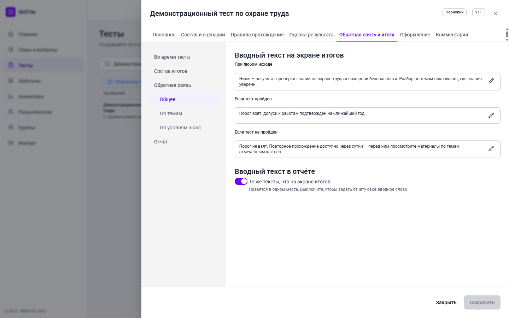
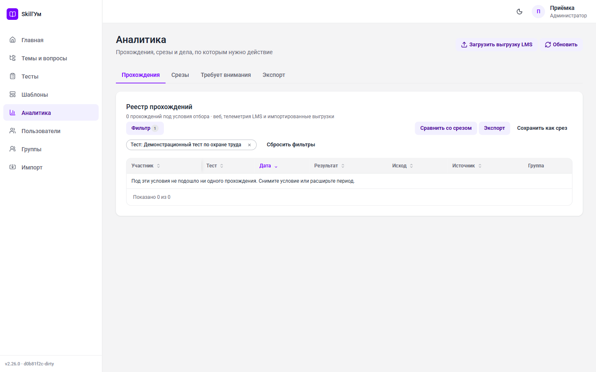

# Как создать тест в Skill'Ум. Руководство автора

Это руководство для человека, которому поручили сделать тест в Skill'Ум. Оно проводит
через весь путь: от первой темы и первого вопроса до опубликованного теста, выданного
ученикам или выгруженного в LMS.

Читать подряд не обязательно. Если нужно просто получить работающий тест как можно
быстрее, хватит раздела «Быстрый старт»: он ведёт по кратчайшему маршруту и занимает
около пятнадцати минут. Все остальные разделы — подробный разбор того, что вы там
пролистнули.

## Содержание

- [Быстрый старт](#быстрый-старт)
- [1. Что нужно знать до начала](#1-что-нужно-знать-до-начала)
- [2. Ориентируемся в интерфейсе](#2-ориентируемся-в-интерфейсе)
- [3. Тема — папка для вопросов](#3-тема--папка-для-вопросов)
- [4. Вопросы](#4-вопросы)
- [5. Массовая загрузка вопросов из Excel](#5-массовая-загрузка-вопросов-из-excel)
- [6. Создаём тест](#6-создаём-тест)
- [7. Вкладка «Основное»](#7-вкладка-основное)
- [8. Вкладка «Состав и сценарий»](#8-вкладка-состав-и-сценарий)
- [9. Вкладка «Правила прохождения»](#9-вкладка-правила-прохождения)
- [10. Вкладка «Оценка результата»](#10-вкладка-оценка-результата)
- [11. Вкладка «Обратная связь и итоги»](#11-вкладка-обратная-связь-и-итоги)
- [12. Вкладка «Оформление»](#12-вкладка-оформление)
- [13. Вкладка «Комментарии»](#13-вкладка-комментарии)
- [14. Проверка: отладочный прогон](#14-проверка-отладочный-прогон)
- [15. Публикация](#15-публикация)
- [16. Выдача ученикам](#16-выдача-ученикам)
- [17. Аналитика](#17-аналитика)
- [18. Частые ошибки и что они значат](#18-частые-ошибки-и-что-они-значат)
- [19. Чек-лист перед публикацией](#19-чек-лист-перед-публикацией)
- [20. Что читать дальше](#20-что-читать-дальше)

---

## Быстрый старт

Маршрут для первого теста: одна тема, пять вопросов, простые настройки, публикация.
Всё, что не упомянуто здесь, имеет разумное значение по умолчанию и может подождать.

### Шаг 1. Войдите в сервис

Откройте адрес сервиса и войдите под своей учётной записью. Если у вас есть право
создавать тесты, в левом меню будут пункты «Темы и вопросы» и «Тесты».


### Шаг 2. Создайте тему

Тема — это папка, в которой лежат вопросы. Тест сам вопросов не хранит: он берёт их
из тем.

1. Откройте «Темы и вопросы».
2. Нажмите круглую кнопку «Создать» в правом нижнем углу и выберите «Добавить тему».
3. Введите название, например «Охрана труда. Базовый курс», и сохраните.


### Шаг 3. Добавьте пять вопросов

1. Той же кнопкой «Создать» выберите «Добавить вопрос».
2. Укажите тему, выберите тип «Один ответ», напишите текст вопроса.
3. Заполните варианты ответа и отметьте верный.
4. Сохраните и повторите ещё четыре раза.


Дальше можно не читать про типы вопросов: одиночного выбора достаточно, чтобы тест
заработал.

### Шаг 4. Создайте тест

1. Откройте «Тесты».
2. Нажмите круглую кнопку «Создать», выберите папку (можно «Корень») и нажмите
   «Создать тест».
3. Откроется ящик редактора. На вкладке «Основное» заполните «Название» — это
   единственное обязательное поле.


### Шаг 5. Наберите состав

1. Перейдите на вкладку «Состав и сценарий», подраздел «Состав».
2. Нажмите «Добавить тему» и выберите созданную тему.
3. В строке темы задайте «Вопросов в тест» — например 5.
4. Нажмите «Применить» внизу ящика, затем «Закрыть».


Тест уже рабочий: остальные вкладки заполнять не обязательно.

### Шаг 6. Прогоните тест сами

В списке тестов нажмите на строке кнопку «Выполнить отладку». Откроется отдельное
окно, где тест проходится ровно так, как его увидит ученик, но без записи попытки.
Пройдите его до конца и посмотрите на экран итогов.


### Шаг 7. Опубликуйте

В меню теста (три точки в строке) выберите «Опубликовать». Тест получает статус
«Опубликован» и становится доступен для выдачи.

Дальше — либо «Назначить» (выдать тест людям внутри сервиса), либо «Экспорт SCORM»
(получить ZIP-пакет для загрузки в LMS). Обе кнопки описаны в разделе
[«Выдача ученикам»](#16-выдача-ученикам).


---

## 1. Что нужно знать до начала

### 1.1. Пять слов, которые встречаются везде

**Вопрос** — одно задание. Живёт в общем банке и может использоваться сразу в
нескольких тестах.

**Тема** — папка, в которой лежат вопросы. Существует независимо от тестов.

**Раздел (состав теста)** — тема, включённая в конкретный тест. Раздел решает,
сколько вопросов из темы получит ученик и какой порог нужно взять.

**Выдача** — сколько вопросов темы реально увидит ученик. Если в теме 40 вопросов, а
в разделе указано «Вопросов в тест: 10», каждый ученик получит случайные 10 из 40.
Это делает попытки разными и защищает банк от переписывания.

**Балл и порог** — сколько очков приносит верный ответ и сколько очков нужно набрать,
чтобы раздел или тест считался сданным.

### 1.2. Цена вопроса принадлежит тесту, а не вопросу

Это правило удивляет чаще всего. Один и тот же вопрос может стоить 1 балл во вводном
тесте и 3 балла в сертификационном. Поэтому в карточке вопроса поля «Баллы» нет —
цена задаётся на вкладке «Оценка» внутри теста. Подробнее — в разделе
[«Оценка результата»](#101-оценка-ответа).

### 1.3. Роли: что вам доступно

Права выдаются ролями, у одного человека их может быть несколько, а итоговые права —
объединение всех.

| Роль | Что может по части тестов |
| --- | --- |
| Автор | Темы, вопросы, тесты, публикация, отладочный прогон, аналитика и загрузка выгрузок LMS, выдача доступа к своим темам и тестам, отправка теста на рецензирование |
| Разработчик | Всё то же плюс выгрузка SCORM и управление шаблонами оформления |
| Менеджер обучения | Назначение тестов, группы, пользователи, аналитика и загрузка выгрузок LMS |
| Администратор | Всё, кроме двух системных настроек суперпользователя |
| Обучающийся | Проходить назначенные тесты и смотреть свои результаты |

Из этой таблицы следуют три практических вывода.

- Кнопки «Экспорт SCORM» у автора нет — выгрузку в LMS делает разработчик или
  администратор. Отладочный прогон при этом автору доступен.
- Кнопки «Назначить» у автора тоже нет — выдачей людям занимается менеджер обучения
  или администратор. А вот позвать коллегу посмотреть свой тест автор может сам:
  пункт меню «Отправить на рецензирование» — его право.
- Загрузить в аналитику выгрузку отчёта из внешней LMS может и автор, и менеджер: роль
  открывает действие, а можно ли писать в конкретный тест — решает доступ к этому тесту.

Поверх ролей действует область видимости: свои тесты и темы вы видите всегда, чужие —
только если вам выдали доступ.

---

## 2. Ориентируемся в интерфейсе

Слева — постоянное меню. В нём показываются только те пункты, на которые у вас есть
право, поэтому список может быть короче приведённого.

| Пункт меню | Зачем нужен |
| --- | --- |
| Главная | Рабочий стол: что вас ждёт, ваши тесты, материалы |
| Темы и вопросы | Единое дерево «Папка → Тема → Вопрос» — весь банк содержимого |
| Тесты | Дерево тестов по папкам, редактор теста, публикация, выдача |
| Шаблоны | Реестр шаблонов оформления (для разработчика и администратора) |
| Аналитика | Сводка по попыткам и результатам |
| Пользователи, Группы | Учётные записи и группы для назначения |
| Импорт | Загрузка книги Excel с вопросами и настройками |


---

## 3. Тема — папка для вопросов

Откройте «Темы и вопросы». Это одно дерево: папки, внутри них темы, внутри тем —
вопросы. Колонки справа показывают тип и сложность вопроса и количество вопросов в
теме.

Круглая кнопка «Создать» в правом нижнем углу разворачивается в три действия:
«Добавить папку», «Добавить тему», «Добавить вопрос».

### 3.1. Свойства темы

Щелчок по строке темы разворачивает и сворачивает её вопросы. Чтобы открыть саму тему,
нажмите кнопку с тремя точками в конце строки и выберите «Настройки темы…» (или
«Доступ…», чтобы попасть сразу на вторую вкладку). Вкладка «Свойства»:

- **Название темы** — обязательное. Сервис проверяет, нет ли уже темы с таким
  названием, и предупреждает: одинаковые названия потом путают при наборе состава.
- **Id (код)** — короткий код темы. Нужен, чтобы ссылаться на тему в формулах
  показателей результата коротко и читаемо. Если показателями вы не пользуетесь, поле
  можно не заполнять.
- **Папка** — где тема лежит в дереве. Выбирается из дерева папок, «Без папки» —
  положить в корень.
- **Описание** — свободный текст для себя и коллег.
- **Толкование темы** — что результат по этой теме ЗНАЧИТ. Печатается при ЛЮБОМ
  вердикте — и когда тема взята, и когда нет, — и в блок «Рекомендации» не попадает.
  Текст здесь БАЗОВЫЙ: его наследует каждый тест с этой темой. Формат выбирается тот
  же, что и у остальных текстов, но приложить курсы, документы и мероприятия нельзя —
  толкование объясняет результат, а не советует, что делать.
- **Обратная связь по теме** — текст и материалы, которые увидит ученик, если тему он
  НЕ прошёл. Редактируется тем же редактором, что и остальные тексты: можно приложить
  курсы, документы и мероприятия.

Отдельный тест вправе сказать своё: и толкование, и обратную связь он переопределяет во
вкладке «Обратная связь и итоги» (см. [11.6](#116-по-темам)) — там же видно, откуда
пришёл текст («из темы» или «этот тест»). Сама тема при этом не меняется, и её текст
остаётся у других тестов.


### 3.2. Доступ к теме

Вкладка «Доступ» появляется у уже созданной темы.

- **Владелец** — кто отвечает за тему; меняется кнопкой «Сменить владельца».
- **Общая тема** — переключатель видимости. Общая тема видна всем авторам; приватная —
  только владельцу, получателям грантов и администратору.
- **Гранты доступа** — выбираете человека, уровень («Просмотр» — можно брать тему в свои
  тесты, «Управление» — можно править содержимое) и нажимаете «Добавить».

Отзыв доступа предлагает два режима: полный отзыв и отзыв с сохранением уже собранных
тестов. Второй нужен, чтобы не сломать чужой опубликованный тест, который опирается на
вашу тему.


---

## 4. Вопросы

Новый вопрос создаётся кнопкой «Создать» → «Добавить вопрос». Существующий открывается
из его строки: три точки в конце → «Редактировать…». Щелчок по самой строке только
разворачивает предпросмотр вариантов — это быстрый способ проверить содержимое, не
открывая редактор.

### 4.1. Типы вопроса

| Тип | Что делает ученик | Когда брать |
| --- | --- | --- |
| Один ответ | Выбирает одну строку | Проверка факта, определения, нормы |
| Несколько ответов | Отмечает все подходящие | Перечни, признаки, исключения |
| Соответствие | Составляет пары «левое — правое» | Термин и определение, роль и функция |
| Ранжирование | Расставляет элементы по порядку | Последовательность действий, приоритеты |
| Шкала | Отмечает степень согласия | Опросники, самооценка, диагностика |
| Распределение баллов | Раскладывает заданный запас баллов по вариантам | Ипсативные методики, выбор приоритетов |
| Короткий ответ | Печатает ответ в одну строку | Термин, орган, норматив — там, где ответ короткий и однозначный |
| Пропуски | Заполняет пропуски внутри текста задания | Формулировки с ключевыми словами, формулы, определения |
| Развёрнутый ответ | Пишет ответ своими словами в многострочном поле | Объяснение, разбор случая, аргументация |

Первые четыре типа — обычная проверка знаний. «Шкала» и «Распределение баллов» нужны
измерительным тестам: их ответы не «верные» и «неверные», а вклады в шкалы (см.
[раздел 10](#103-шкалы)).

Последние три — ответ текстом. «Короткий ответ» и «Пропуски» проверяются автоматически:
вместо вариантов автор задаёт правила сравнения, а рядом с ними стоит проба — наберите
вариант ответа и сразу увидите, засчитается он или нет (проба ничего не сохраняет и на
оценку не влияет). «Развёрнутый ответ» автопроверки не имеет: ответ сохраняется и ждёт
человека. Пока проверки нет, такое задание не приносит баллов и НЕ входит в проверенный
максимум — то есть не портит процент и вердикт; тест из одних развёрнутых ответов
завершается без оценки, как опросник.

### 4.2. Поля карточки вопроса

Поля идут сверху вниз в том же порядке, что и в ящике.

- **Тема** — куда положить вопрос. Список с поиском: начните вводить название, и он
  отберёт темы по любому куску имени, подсветив совпадение. Крестик справа сбрасывает
  выбор.
- **Тип вопроса** — выпадающий список из значений выше. Смена типа перестраивает блок
  вариантов.
- **Текст вопроса** — набирается в одном из трёх режимов, переключаемых над полем:
  - **Разметка** (по умолчанию) — простая разметка: `**жирный**`, `*курсив*`,
    `[текст](ссылка)`;
  - **Форматированный** — визуальный набор: жирный, курсив, список и ссылка кнопками;
  - **HTML** — теги руками, для тех, кто переносит готовую вёрстку.

  Переключение режима спрашивает согласия и показывает, что именно изменится: перевод
  меняет сам текст задания, и отменить его можно только вручную.

  Кнопки над полем ставят листинг (с выбором языка), формулу и пропуск — во всех трёх
  режимах одинаково. Формула пишется двумя долларами (`$$E = mc^2$$`), пропуск — двойными
  фигурными скобками (`{{city}}`).

  Кнопка **«Предпросмотр»** в подвале окна показывает задание глазами участника: с
  подсвеченным листингом, формулой-картинкой и полями пропусков.

  Если при сохранении из текста пришлось вырезать небезопасную разметку, ящик об этом
  скажет отдельным сообщением — «Часть разметки удалена при сохранении» — и перечислит,
  что именно ушло. Молча текст не меняется.
- **Варианты ответа** — свои поля для каждого типа. Строки перетаскиваются за рукоятку
  слева, верные отмечаются флажком. У «Шкалы» это градации, и рядом стоит переключатель
  **«Есть правильный ответ»**: выключенный, он делает вопрос измерительным — без проверки
  и баллов, только вклад в шкалы. У «Распределения баллов» вместо верных ответов —
  «Бюджет» и границы «Минимум/Максимум на вариант».
- **Проверка ответа** — блок, который появляется у «Короткого ответа» и «Пропусков»
  вместо вариантов; подробно — в [4.3](#43-проверка-текстового-ответа).
- **Случайный порядок вариантов** — перемешивать строки при каждой выдаче. Не
  включайте, если среди вариантов есть «все перечисленное».
- **Сложность** — необязательная: переключатель «Не задано» открывает ползунок 0–100.
  Нужна для адаптивного режима и для аналитики.
- **Индекс в теме** — позиция вопроса при фиксированном порядке выдачи. Пусто — такие
  вопросы идут последними. Задавайте с шагом 10, чтобы потом было куда вставлять.
- **Медиа** — картинка, аудио или видео, прикреплённые к заданию. Медиа считается частью
  вопроса и уезжает вместе с ним в SCORM-пакет.
- **Теги (подтемы)** — короткие метки внутри темы. По ним можно потребовать в тесте
  «два вопроса про средства защиты из пяти» — см.
  [квоты по подтемам](#83-квоты-по-подтемам).
- **Обратная связь** — что показать ученику после ответа. Переключатель «Общая /
  Условная» разделяет текст по исходам: верно, неверно, частично.

У текстовых типов между «Текстом вопроса» и проверкой стоят ещё три поля: **«Подсказка
в поле»** (что участник увидит в пустой строке), **«Предел длины ответа»** (пусто —
системный предел) и **«Ответ обязателен»**.

Поля «Баллы» в карточке нет намеренно: цена задаётся в тесте.


### 4.3. Проверка текстового ответа

У «Короткого ответа» и «Пропусков» правильный ответ нельзя отметить галочкой — его
приходится описывать правилом. Этим занят блок **«Проверка ответа»**.

Переключатель **«Проверять ответ автоматически»** — главный: выключенный, он оставляет
задание собирающим текст, и баллов оно не приносит. Включённый, открывает четыре
настройки.

- **«Ответ участника — это»** — «Текст» или «Число». Выбор меняет весь остальной блок:
  текст сравнивается словами, число — величинами.
- **«Ответ засчитывается, если выполнено»** — «Любое правило» или «Все правила». Связка
  печатается между строками списка («и» / «или»), чтобы набор читался сверху вниз одной
  фразой.
- **«Единица измерения»** — только у числа: подпись у поля ответа. Участник вводит
  число, единицу не печатает.
- **Правила** — список. Пока он пуст, задание собирает ответы и баллов не приносит.

Текстовое правило сравнивает **«Обычным»** способом (с подстановочными знаками: `*` —
любой кусок, `?` — один символ) или **«Регулярным выражением»**. Числовое задаёт
условие (равно, больше, меньше и так далее) и допуск — **«в единицах»** или **«в
процентах»**; под полями сервис пересказывает правило словами, чтобы его можно было
прочитать, а не расшифровать.

Рядом стоит **проба**: наберите вариант ответа — и увидите, засчитается он или нет, а
каждое правило пометится «выполнено» или «не выполнено». Проба ничего не сохраняет и на
оценку не влияет. Слишком тяжёлое регулярное выражение сервис не выполняет ни в пробе,
ни в пакете: он назовёт его долгим и предложит заменить обычным сравнением.

У «Пропусков» тот же блок, только свой набор правил у каждого пропуска: список пропусков
собран по меткам `{{имя}}` из текста задания, и удаление пропуска уносит его правила.

«Развёрнутый ответ» автопроверки не имеет вовсе: у него из этого блока остаются только
подсказка, предел длины и обязательность.

### 4.4. Если вопрос уже используется

Правка вопроса, который входит в опубликованные тесты, проходит через проверку
последствий: сервис покажет, какие тесты затронуты, и попросит подтверждение. Это же
касается удаления и переноса вопроса в другую тему.

---

## 5. Массовая загрузка вопросов из Excel

Когда вопросов не пять, а двести, руками их не заводят. Раздел «Импорт» принимает
книгу Excel: лист «Вопросы» обязателен, остальные листы добавляют настройки теста —
структуру, квоты, оценку, шкалы, показатели.

Порядок работы:

1. Скачайте шаблон книги со страницы «Импорт».
2. Заполните лист «Вопросы».
3. Загрузите файл. Сервис сам определит, что в книге есть, и предложит либо пополнить
   общий банк вопросов, либо собрать (или обновить) конкретный тест.
4. Сначала выполните пробный разбор — он покажет, что будет создано, ничего не меняя.
5. Если результат устраивает, подтвердите импорт.


Книга возит не только вопросы: листами задаются разделы и квоты, оценка, шкалы,
показатели, страницы сценария (включая признак «Скрыт»), тексты обратной связи и
толкований, вводные тексты по исходу. Правило «всё настраивается в интерфейсе» при этом
в силе: книга — способ сделать то же самое быстрее и пачкой, а не единственный путь к
настройке.

Подробный разбор каждого листа и каждой колонки — в отдельном руководстве
[«Как заполнить шаблон импорта»](import-workbook-guide.md).

Обратный путь тоже есть: в меню теста пункт «Экспорт в Excel» выгружает готовый тест
книгой — удобно, чтобы размножить настройки на соседний тест. А если тест переезжает на
другую установку сервиса целиком, вместе с оформлением и вложениями, — это уже пакет
`.tbtest` ([15.1](#151-что-ещё-есть-в-меню-теста)).

---

## 6. Создаём тест

Откройте «Тесты». Это дерево: папки и тесты в них. Сверху — поиск, фильтры
(«Статус», «Режим», «Сценарий», «Владелец», «Область») и сортировка.

Круглая кнопка «Создать» открывает окно «Новый тест»: выбираете папку и нажимаете
«Создать тест». Сразу открывается ящик редактора.


### 6.1. Как устроен ящик редактора

Редактор — широкий выдвижной ящик справа. Сверху название теста и метки состояния
(«Черновик», «Опубликован», «Изменено», «Есть ошибки»), ниже — семь вкладок, внизу —
кнопки сохранения.

Каждая вкладка отвечает на ОДИН вопрос о тесте, и идут они в том порядке, в каком эти
вопросы задают.

| Вкладка | На какой вопрос отвечает |
| --- | --- |
| Основное | Что это за тест: название, описание, режим, интеграция |
| Состав и сценарий | Из чего он собран и как ведёт участника |
| Правила прохождения | По каким правилам участник идёт: навигация, ограничения, защита |
| Оценка результата | Как считается результат: цена ответа, вердикт, шкалы, показатели |
| Обратная связь и итоги | Что участник узнаёт о результате: итоги, тексты, отчёт |
| Оформление | Как тест выглядит: шаблон и объявленные им параметры |
| Комментарии | Что о тесте сказали коллеги |

У пяти вкладок из семи слева стоит рельс подразделов, справа — их поля. У «Основного»
рельса нет: полей там немного. У «Комментариев» — тоже: это одна лента обсуждений.

Важные особенности работы ящика:

- Правки живут в черновике редактора и попадают на сервер только по кнопке
  **«Применить»**. В подвале ящика три действия, и они не пересекаются:
  - **«Применить»** — записать набранное и остаться в ящике. Жмите столько раз, сколько
    нужно: это не выход. У нового теста первое нажатие создаёт тест, и ящик продолжает
    работу уже с ним — заголовок меняется с «Новый тест» на название, появляется вкладка
    «Комментарии».
  - **«Отменить»** — отказаться от набранного: правки откатываются, ящик закрывается
    сразу, без вопросов.
  - **«Закрыть»** — выйти. Если есть неприменённые правки, сервис переспросит:
    «Сохранить», «Выйти без сохранения» или «Продолжить редактирование». То же
    спрашивает крестик в шапке и клик мимо ящика.
- «Применить» одна на весь ящик: она записывает и настройки теста, и оформление,
  и полотно сценария — несколькими запросами, но одним вашим действием. Отдельной кнопки
  «Сохранить оформление» больше нет.
- Рядом стоит **«Показать изменения»** — список того, что вы наменяли в этом
  сеансе, поле за полем, со старым и новым значением. Полезно перед применением чужого
  или давно не открывавшегося теста.
- На вкладках, где есть несохранённые правки, появляется точка; на вкладках с
  ошибками — значок ошибки, на вкладках с замечаниями — предупреждающий. Кнопки
  «Перейти к ошибкам» и «Перейти к предупреждениям» ведут к первому проблемному полю —
  и раскрывают свёрнутую карточку, если поле спрятано внутри неё.
- Настраивать новый тест можно целиком, не сохраняя его по частям: оформление,
  оценка вопросов, шкалы и показатели набираются сразу, копятся в черновике и
  записываются одним «Применить» вместе с самим тестом. Исключение одно — вкладки
  «Комментарии» у нового теста нет: обсуждать пока нечего.

### 6.2. Если вы работали с прежним ящиком

Прежде вкладки делили настройки по происхождению — «Настройки», «Оформление»,
«Структура», «Оценка», «Шкалы», «Показатели», — и один вопрос автора расходился по трём
местам. Теперь деление другое, и часть привычных полей стоит не там, где стояла.
Настройки не изменились и не потерялись, у них новые адреса.

| Что искали раньше | Где теперь |
| --- | --- |
| «Настройки» → «Основное» → «Сценарий прохождения» | «Состав и сценарий» → «Сценарий» |
| «Настройки» → «Основное» → «Вводный текст» | «Обратная связь и итоги» → «Обратная связь» → «Общее» (тремя текстами по исходу) |
| «Общая обратная связь теста» (карточка целиком) | Снята. То же самое говорят вводные тексты, см. [11.5](#115-общее-вводный-текст-по-исходу) |
| «Настройки» → «Основное» → «Отчёт о результатах» | «Обратная связь и итоги» → «Отчёт» |
| «Настройки» → «Правила прохождения» → «Тест пройден, если», «Правила прохождения тем» | «Оценка результата» → «Вердикт» (таблица называется «Правила оценки тем») |
| «Настройки» → «Правила прохождения» → «Подытоги по ключам» и два поля рядом | «Обратная связь и итоги» → «Состав итогов», группа «Подытоги по подтемам» |
| «Настройки» → «Правила прохождения» → «Показывать итоги раздела» | «Обратная связь и итоги» → «Во время теста» |
| «Настройки» → «Правила прохождения» → «Показывать правильные ответы…» | «Обратная связь и итоги» → «Во время теста» |
| «Настройки» → «Ограничения» → «Результат для LMS при нескольких попытках» | «Основное» |
| «Настройки» → «Адаптивный режим» → лестница уровней | «Состав и сценарий» → «Адаптивные уровни» |
| «Настройки» → «Адаптивный режим» → «Показывать уровень сложности…» | «Правила прохождения» → «Во время прохождения» |
| Вкладки «Оценка», «Шкалы», «Показатели» | «Оценка результата», три подраздела из четырёх |
| Вкладка «Структура» (полотно экранов) | «Состав и сценарий» → «Сценарий» |
| «Оформление» → «Итоги»: надписи и порядок блоков | «Обратная связь и итоги» → «Состав итогов» |
| «Оформление» → «Прогресс и шапка» | «Правила прохождения» → «Во время прохождения» |
| «Оформление» → «Отчёт о результатах»: что печатать | «Обратная связь и итоги» → «Отчёт» |
| «Состав» → текст обратной связи в строке темы | «Обратная связь и итоги» → «Обратная связь» → «По темам» |
| «Состав» → «Блоки итогов» | Теперь это группы тем, см. [8.5](#85-группы-тем) |

---

## 7. Вкладка «Основное»

Что это за тест. Полей немного, и все они про сам тест, а не про его содержимое.

- **Название** — обязательное поле. Без него тест не сохранится.
- **Описание** — что это за тест, для кого. Набирается в трёх режимах — «Простой текст»,
  «Форматированный», «HTML», — потому что это не служебная пометка:
  описание печатается на стартовом экране, уходит в метаданные SCORM-пакета и в письмо с
  приглашением. Там, где разметка неуместна — в карточке теста и в тексте письма, —
  печатается его плоская проекция.
- **Режим теста** — «Стандартный» или «Адаптивный». Адаптивный подбирает сложность
  под ответы ученика; лестница уровней настраивается во вкладке «Состав и сценарий».
- **Webhook URL** — адрес, куда сервис сообщит о завершении попытки. Пусто — webhook не
  нужен.
- **Отправлять телеметрию о прохождении** — детальные события прохождения. В отладочном
  прогоне телеметрия всегда выключена.
- **Результат для LMS при нескольких попытках** — что SCORM-пакет отдаёт внешней системе,
  когда попыток несколько: «Лучшая попытка» или «Последняя попытка». Действует ТОЛЬКО в
  выгруженном пакете; внутри сервиса внешней системы нет, и настройка ни на что не влияет.
  У новых тестов стоит «Последняя»: большинство LMS сами решают, какую попытку засчитать, и
  ждут от курса данные текущей. «Лучшую» выбирайте, когда LMS хранит только последний
  присланный результат и удачную попытку надо защитить от неудачной. Тесты, заведённые до
  появления настройки, остались на «Лучшей» — их поведение не менялось.


---

## 8. Вкладка «Состав и сценарий»

Из чего собран тест и как он ведёт участника. Рельс делит вкладку на «Состав»,
«Сценарий» и — только у адаптивного теста — «Адаптивные уровни».

### 8.1. Подраздел «Состав»

Здесь тест набирается из тем. Минимум одна тема обязательна: без неё тест не
сохранится.


Сверху — поле **«Поиск темы»** (у теста их бывает под два десятка) и общее правило
выдачи; под ними кнопки **«Добавить тему»** и **«Добавить группу»**.

Поле над списком тем задаёт общее правило выдачи для всего теста.

| Значение | Что происходит |
| --- | --- |
| Фиксированный порядок | Темы идут по списку, вопросы — по заданному в теме индексу |
| Перемешивание | Вопросы перемешиваются внутри темы, темы идут по списку |
| Полное перемешивание | Вопросы всех тем идут одним перемешанным потоком |

«Полное перемешивание» предлагается только в плоском сценарии: в сценариях с разбивкой
по темам между темами стоят собственные экраны, и смешивать через них нечего.

У каждой темы есть своя строка «Порядок вопросов» — она либо наследует общее правило,
либо переопределяет его для этой темы.

### 8.2. Строка темы

- **Обязательная** — переключатель в заголовке строки. Обязательная тема должна быть
  пройдена, если общее правило теста этого требует.
- **Все вопросы темы** — выдавать тему целиком, без выборки. Когда включено, поле
  «Вопросов в тест» не действует.
- **Вопросов в тест** — размер выборки: значение от 1 до количества вопросов в теме
  (рядом подписано «из N»).
- **Порядок вопросов** — «Как в тесте» (наследовать общее правило) или своё значение
  для этой темы.
- **Корзина справа** — убрать тему из теста.

Кнопка «Добавить тему» открывает список тем, которых в тесте ещё нет.

**Сколько людей увидят одно и то же задание.** В шапке строки темы, сразу за сводкой
«N вопросов в банке · выдаётся M», стоит хвост «· увидят X %», а внутри карточки то же
число написано словами: «Каждое задание темы увидят около X % участников». Это не
статистика прошедших, а арифметика выдачи: она считается на пустом тесте, то есть тогда,
когда настройку ещё можно исправить. Пока запаса банка хватает, надпись спокойная; когда
выдача съедает банк за один поток («выдаётся 10 из 12»), она становится предупреждением
и прямо советует пополнить тему или уменьшить выборку. Задания, которые видят все,
пересказывают друг другу — ради этого счёт и показан.

Сама выдача тоже учитывает это: из двух одинаково подходящих вопросов тест чаще возьмёт
тот, который показывали реже. Настраивать здесь нечего — поправка работает и в вебе, и в
собранном пакете.

Текста обратной связи в строке темы больше нет: тексты собраны в одном месте — во
вкладке «Обратная связь и итоги», подраздел «Обратная связь», карточка «По темам»
(см. [11.6](#116-по-темам)).

### 8.3. Квоты по подтемам

Если вопросы размечены тегами, у темы раскрывается блок «Квоты по подтемам (тегам)».
Он позволяет потребовать: из десяти выдаваемых вопросов три обязательно про пожарную
безопасность, два — про электробезопасность, остальные любые.

Каждая строка квоты — это подтема (тег), количество и режим: «Ровно» столько вопросов
или «Не менее» столько. Под таблицей идёт счётчик вида «Σ квот: 2 из 5 · остаток 3».

Правила блока:

- Сумма квот не может превышать «Вопросов в тест». Сервис блокирует сохранение и
  объясняет, на сколько превышение.
- Квоты — срезы внутри выборки, а не добавка к ней.
- Квоты недоступны, когда выдаётся вся тема целиком: делить нечего.


### 8.4. Подтема судится порогом своей темы

Подтема (тег вопросов) — единица РЕЗУЛЬТАТА и обратной связи. Её результат считается,
показывается полосой на итогах и в отчёте и решает, получит ли ученик написанный вами
текст. Отдельного порога у подтемы НЕТ и задать его негде: ни переключателя «Пороги по
подтемам (тегам)», ни колонки «Порог» в таблице квот больше нет.

По умолчанию подтемы вердикт темы не трогают: тема считается правилом самой темы, и
ничем больше. Если вы хотите, чтобы средний по теме результат не закрывал провал внутри
неё, включите переключатель **«Учитывать подтемы в вердикте темы»** во вкладке «Оценка
результата», подраздел «Вердикт» (см. [10.2](#102-вердикт)). Он один на весь тест, а не
на тему, и по умолчанию выключен.

Когда он включён:

- **порог подтемы — это порог её темы.** Отдельных чисел нет: тема с порогом 70 %
  требует 70 % и от каждой своей подтемы;
- **тема не пройдена, если хотя бы одна её подтема набрала меньше порога.** Тема,
  набравшая 85 % при пороге 70 %, окажется НЕ пройденной, если одна из её подтем
  осталась на 40 %;
- **тема без порога не судит и свои подтемы.** У темы выбрано «Не проверять отдельно» —
  её подтемы тоже никого не роняют: судить их нечем;
- **подтема, не попавшая в выдачу, вердикт не роняет.** Если случайная выборка не дала
  ни одного вопроса с этим тегом, считать по нему нечего;
- **тема с вариантами судится порогом доставленного варианта** — того, который достался
  ученику, а не всех сразу.

Сверьте перед публикацией две вещи. Первая: вердикт уже собранного теста от включения
переключателя может измениться — там, где тема проходила «в среднем», она начнёт
проваливаться из-за одной подтемы. Вторая: если подтемы вердикт решают, а на итогах они
скрыты, ученик не поймёт причину — при публикации сервис об этом предупредит, и
предупреждение просит открыть показ подытогов, а не блокирует выпуск.

Требование «по этой подтеме надо набрать столько-то» без общего переключателя
по-прежнему выражается текстом обратной связи подтемы (см.
[11.7](#117-по-подтемам-тегам)).

### 8.5. Группы тем

Темы теста можно разложить по названным группам — «Обязательная часть» и
«Дополнительная часть», «Теория» и «Практика», — и на экране итогов, и в отчёте карточки
тем печатаются этими группами, под их заголовками, со счётчиком у каждой.

Заводится группа кнопкой **«Добавить группу»** рядом с «Добавить тему». Дальше:

- имя группы правится прямо в её шапке — это поле, а не диалог;
- тема попадает в группу ПЕРЕТАСКИВАНИЕМ за рукоятку; отдельного поля «группа» в строке
  темы нет намеренно — иначе одно и то же задавалось бы в двух местах;
- карточки групп тоже перетаскиваются между собой: их порядок — это порядок блоков на
  итогах;
- пока есть хоть одна группа, внизу стоит служебная карточка **«Темы вне групп»**: это
  не группа, а остаток, и она печатается после всех групп. Переименовать, переставить
  или удалить её нельзя;
- удаление группы тем не удаляет — они уходят «вне групп». Пустая группа остаётся жить:
  пустой её оставили вы, а не сервис.

Счётчик блока («Пройдено 2 из 3») подписывается надписью «Группы разделов» во вкладке
«Обратная связь и итоги» (см. [11.4](#114-надписи-и-заголовки)).

Группы — про то, как результат ПОКАЗАН. Вердикт они не считают и на выдачу не влияют:
это делают правила оценки тем и квоты по подтемам.

### 8.6. Варианты теста

Переключатель «Варианты теста» в строке темы — альтернатива случайной выборке. Вместо
«дай пять случайных» вы заранее собираете фиксированные варианты («Вариант А»,
«Вариант Б») и перечисляете, какие именно вопросы в них входят. Ученику достаётся
вариант целиком, а на повторной попытке выдаётся другой.

Когда режим включён, квоты по подтемам и порядок вопросов для этой темы недоступны:
состав и порядок уже заданы вариантом.

### 8.7. Подраздел «Адаптивные уровни»

Подраздел появляется, только если режим теста «Адаптивный». В нём собирается лестница
уровней: какие темы участвуют в адаптивной выдаче и из каких уровней состоит каждая.

У уровня задаются название, диапазон сложности вопросов («Сложность от» и «до»),
сколько вопросов выдавать, тип порога («Процент» или «Абсолютный») и сам порог. Рядом
со строкой уровня сервис показывает, выполнима ли она на текущем банке вопросов.

Текстов обратной связи в лестнице больше нет: они переехали во вкладку «Обратная связь
и итоги», пункт «По уровням сложности» (см. [11.9](#119-по-уровням)). Переключатель
«Показывать уровень сложности при прохождении» — во вкладке «Правила прохождения»,
подраздел «Во время прохождения»: это то, что участник видит по ходу, а не устройство
лестницы.

Адаптивный режим несовместим с линейным плоским сценарием — сервис предупредит об этом
прямо в поле выбора сценария.

### 8.8. Подраздел «Сценарий»

Вверху — поле «Сценарий прохождения»: как ученик перемещается по тесту.

- «Линейный» — все вопросы идут одним потоком, границ между темами ученик не видит;
- «Линейный по темам» — темы идут блоками, между ними системные экраны;
- «Через страницу-маршрутизатор» — ученик сам выбирает, какую тему проходить.

В адаптивном режиме «Линейный» недоступен: адаптивная выдача требует разделения по
темам.

Ниже — полотно сценария: путь ученика как последовательность экранов, разложенная по
трём зонам.

- **До теста** — системный экран «Старт» и ваши информационные страницы: инструкция,
  правила, согласие.
- **Внутри теста** — «Маршрутизатор» (экран выбора темы, если выбран соответствующий
  сценарий) и блок каждой темы: «Введение раздела», строка с вопросами темы («5 вопросов
  темы …»), «Обзор раздела» и «Итоги раздела». Обзор появляется, когда включён возврат к
  неотвеченным вопросам. «Итоги раздела» стоят в полотне всегда: выключенный экран не
  исчезает, а приглушается и получает пиктограмму перечёркнутого глаза.
- **После теста** — экран «Итоги теста» и ваши страницы после него. Страницы этой зоны
  доигрываются и в вебе, и в пакете — ученик читает их после итогов.

У НОВОГО теста полотно работает так же, как у сохранённого: системные экраны показываются
сразу — они рассчитаны по выбранному сценарию, составу тем и шаблону, — и вы добавляете
свои страницы, меняете макеты и порядок ещё до первого сохранения. При создании теста
системные экраны встанут ровно так, как показаны, а ваши страницы допишутся к ним.

#### Подзаголовок раздела

Раскройте строку «Введение раздела» — кроме поля с текстом инструкции там стоят ещё две
настройки, отвечающие за строку НАД этим текстом (по умолчанию «Инструкция»):

- **«Подзаголовок раздела»** — ваша формулировка. Оставьте поле пустым (серым в нём написано
  «Инструкция») — и печататься будет то, что предлагает шаблон.
- **«Показывать подзаголовок раздела»** — выключите тумблер, если строка не нужна вовсе. Текст
  инструкции при этом остаётся на месте, исчезает только надпись над ним; поле с формулировкой
  прячется, пока тумблер выключен.

Настройка своя у каждого раздела: в одном может стоять «Инструкция», в другом — «Как отвечать»,
в третьем не стоять ничего.

#### Свойства экрана «Итоги теста»

Раскройте строку «Итоги теста» — у неё тоже есть свои поля, и их стоит знать, потому что
половина вопросов «почему на итогах печатается вот это» решается здесь.

- **«Заголовок документа»** — что стоит над результатом. Пусто — печатается название
  теста. Действует сразу на трёх выдачах: экран итогов, отчёт и пакет.
- **«Заголовок при успехе»** и **«Заголовок при неуспехе»** — крупная строка вердикта.
  Пусто — «Тест пройден» и «Тест не пройден».
- **«Сводка баллов»**, **«Показатели»**, **«Шкалы»** — три переключателя вида
  «Автоматически / Показывать / Скрывать». «Автоматически» означает «печатать, если
  есть что»: опросник без оценки сводку баллов не покажет сам.
- **«Диаграмма по шкалам»** — «Не показывать», «Авто», «Радар» или «Роза». Роза
  показывает расклад одного целого и годится, когда шкалы делят общий бюджет; радар
  сравнивает независимые шкалы между собой. Рядом — **«Предел оси радара»** и
  **«Оформление шкал»** (цвет и пиктограмма каждой шкалы; их читает роза).

Набор полей объявляет шаблон, поэтому у другого шаблона он может отличаться. У страниц,
которые вы добавили сами, поля свои — те, что объявил их макет.

Что можно делать на полотне:

- добавлять свои информационные страницы кнопкой «Добавить страницу» в нужном месте;
- править их прямо в строке;
- перетаскивать, меняя порядок;
- удалять;
- у системных экранов — менять макет, если шаблон предлагает несколько (у строки
  написано, сколько вариантов доступно);
- открывать предпросмотр любого экрана: меню строки «…» → «Предпросмотр»;
- скрывать экран от ученика: меню строки «…» → «Скрыть». Скрытый экран остаётся в
  полотне приглушённым, а перед его бейджем появляется пиктограмма перечёркнутого
  глаза; возвращается он тем же меню — «Показать». Скрыть можно любую карточку, кроме
  двух: «Вопросы» — это сам тест, «Маршрутизатор» — способ навигации по нему; у них
  пункт погашен.


Предупреждения на полотне чаще всего означают, что выбранный макет экрана отсутствует в
текущем шаблоне — так бывает после смены шаблона.

Что значит скрытый экран для ученика:

- **«Старт»** — прохождение начинается сразу, без страницы с кнопкой «Начать». Если
  попытка не закончена или действует период охлаждения, стартовая всё равно покажется:
  там ученик выбирает «продолжить» и там же написано, когда можно будет пройти снова.
- **«Итоги теста»** — результат считается и сохраняется как обычно, он уходит в LMS и в
  отчёт; ученик просто не видит экран. Дальше он читает ваши страницы «После теста», а
  если их нет — прохождение на этом заканчивается. Одинаково в пакете и в вебе.
- **«Обзор раздела»** — раздел завершается без экрана обзора.
- **«Итоги раздела»** — то же, что выключить переключатель «Показывать итоги раздела»
  («Обратная связь и итоги» → «Во время теста»): одна настройка, два места.
- **«Введение раздела» и ваши страницы** — просто не выдаются; текст и оформление
  сохраняются, в отличие от удаления.

---

## 9. Вкладка «Правила прохождения»

По каким правилам участник идёт по тесту. Четыре подраздела: «Навигация», «Во время
прохождения», «Ограничения», «Защита контента».

### 9.1. Навигация

- **Разрешить возврат к неотвеченным вопросам** — можно ли пропускать вопросы и
  возвращаться к ним. Включает карту прогресса и экран обзора.
- **Свободная навигация внутри раздела** — доступно только при включённом возврате.
- **Позволить изменять ответ до завершения** — доступно только при включённом возврате.
- **Не показывать обзор, если отвечены все вопросы** — убирает лишний экран у
  аккуратного ученика.
- **Переходить к следующему вопросу сразу после ответа** — режим без кнопки «Далее».

Два из этих переключателей гаснут, когда включён показ правильных ответов: иначе ученик
увидел бы верный ответ и переправил свой. Под погашенным переключателем сервис пишет
причину вместе с её адресом — «Обратная связь и итоги» → «Во время теста», — чтобы её не
пришлось искать по всему ящику. «Свободной навигации» показ правильных ответов не мешает:
открытый вперёд вопрос чужой подсказки не показывает.

**Что даёт свободная навигация.** Без неё ученик идёт вперёд по одному вопросу и может
вернуться только к тем, что уже видел; будущие точки карты помечены «не выдан» и не
нажимаются. С ней внутри ТЕКУЩЕГО раздела открыт любой вопрос, включая ещё не показанный, и
пометки «не выдан» внутри раздела больше нет. Границы при этом остаются:

- за раздел перехода нет — соседний откроется, когда текущий завершён;
- завершённый раздел заблокирован целиком, как и раньше;
- в сплошном сценарии разделов нет, и свобода действует на весь тест;
- у адаптивного теста настройка не применяется: порядок ведёт лестница уровней.

Экран обзора остаётся и перечисляет все вопросы раздела, включая непоказанные, — он
перестаёт быть единственным путём к вопросу, но остаётся способом завершить раздел. Учтите
одно: прыжок по карте адресует ВОПРОС, поэтому страницы-вставки, стоящие между вопросами,
при таком прыжке не показываются.

Настройка выключена по умолчанию, в том числе у тестов, созданных раньше: их прохождение не
меняется, пока автор не включит её сам.


### 9.2. Во время прохождения

Что участник видит на экране вопроса. Группа так и подписана — «Что видит ученик во время
прохождения теста», — и полей в ней два источника:

- параметры прогресса и шапки, которые объявил шаблон оформления, — их набор у каждого
  шаблона свой, и если шаблон не объявил ни одного, вы увидите сообщение вместо полей;
- **Показывать уровень сложности при прохождении** — только у адаптивного теста. У
  стандартного вместо переключателя стоит пояснение, что показывать нечего.

### 9.3. Ограничения

Подраздел разделён на две группы. **«Ограничения попытки»** — про одну попытку:

- **Лимит времени теста** — в минутах. 0 — не ограничивать. От часа и больше сервис
  пересказывает значение человеческим языком («Сейчас это 2 ч 30 мин на одну попытку»),
  чтобы не считать часы в уме: срок в две недели, набранный минутами, — это 20160, и без
  расшифровки такое число ни о чём не говорит. Считается АКТИВНОЕ время: закрыл курс, вернулся через час —
  таймер продолжится с того места, где остановился, а не сгорит. «Пройти до такого-то
  числа» — это другое ограничение, оно задаётся сроком при назначении.
- **Индивидуальные лимиты для тем** — включите, чтобы задать время потемно; пока
  выключено, действует только общий лимит теста.
- **Закрывать раздел при выходе** — появляется, когда задан хоть один лимит. У активного
  времени есть оборотная сторона: закрыв курс, ученик может спокойно поискать ответ на
  вопрос, который уже видел, и вернуться к нему с тем же остатком. Включите переключатель
  для оцениваемых тестов высоких ставок: раздел, который ученик покинул — перешёл дальше,
  вернулся к списку разделов, закрыл браузер или перезагрузил страницу, — закрывается
  насовсем. Ответы, данные до выхода, засчитываются, остальные вопросы раздела остаются
  без ответа. В тесте без разделов весь тест — один раздел, поэтому выход завершает
  попытку. Обзор своего раздела выходом не считается, короткий обрыв связи в вебе (до двух
  минут) — тоже. Ученик видит предупреждение на первом вопросе раздела и объяснение, если
  вернётся в закрытый.


**«Ограничения повторных попыток»** — про то, сколько раз и как часто тест можно
проходить снова.

- **Максимум попыток** — сколько раз ученик может пройти тест. 0 — без ограничения.
- **Ограничить повторное прохождение** — выключатель периода охлаждения.
- **Период охлаждения, календарных дней** — сколько ждать до следующей попытки.
- **Разделять период по результату попытки** — задать разные сроки после успешной и
  после неуспешной попытки.
- **Интервал, часов** — минимальный зазор между попытками, если считать не в днях.
- **Способ проверки (плагин)** и **политика при ошибке проверки допуска** — на случай
  внешней проверки права на попытку: «Разрешить старт» или «Заблокировать», если
  проверка не отвечает. Проверка через WebTutor ищет прошлые попытки по названию курса,
  поэтому сработает она только при точном совпадении названия курса в LMS с названием
  этого теста.

### 9.4. Защита контента

- **Защищать текст задания от копирования** — текст не выделяется и не печатается. В
  отладочном прогоне автора защита не действует.
- **Показывать водяной знак** — поверх экранов печатается обезличенный идентификатор и
  время: снимок экрана остаётся возможным, но становится атрибутируемым.
- **Скрывать задание при уходе из окна** — при переключении на другую вкладку задание
  закрывается заглушкой. Таймер и ответы не затрагиваются.

---

## 10. Вкладка «Оценка результата»

Как считается результат. Четыре подраздела: «Оценка ответа», «Вердикт», «Шкалы»,
«Показатели». Всё, что здесь стоит, — числа; слова о результате живут в соседней
вкладке.

### 10.1. Оценка ответа

Цена ответа принадлежит тесту. Этот подраздел — единственное место, где она задаётся.

Работают три уровня, от общего к частному:

1. **Балл за вопрос по умолчанию** — верхнее поле подраздела, на весь тест.
2. **Балл по умолчанию в секции** — переопределяет тестовый для одной темы.
3. **Настройка отдельного вопроса** — переопределяет оба.

Если ничего не задавать, вопрос стоит один балл и оценивается точным совпадением.

Таблица вопросов показывает не то, что записано, а то, что реально получится
(действующие значения). Строка с индивидуальной настройкой помечается акцентной
полосой, переопределённые ячейки — мягкой заливкой, а в конце строки стоит метка
«задано в тесте» и стрелка сброса.


Карандаш в строке открывает окно «Оценка вопроса в тесте». В нём задаются:

- **Балл за вопрос в этом тесте** — пусто означает «взять из цепочки умолчаний», 0 —
  вопрос без баллов именно в этом тесте.
- **Сложность в этом тесте** — переопределение базовой сложности вопроса. Используется
  адаптивной выдачей.
- **Цена ответа** — способ начисления:
  - «Точное совпадение» — балл целиком за полностью верный ответ, иначе ноль;
  - «Веса опций» — у каждого варианта свой вес (для вопросов с одним ответом);
  - «Ступенчато» — таблица условий над счётчиками ответа: **c** — сколько верных
    выбрано, **x** — сколько лишних, **T** — сколько верных всего. Ступени проверяются
    сверху вниз, засчитывается первая подходящая. Строка «Верных = T и лишних = 0 — три
    балла» означает «полный ответ — три балла».

Кнопка «Сбросить настройку» (в окне и стрелкой в строке таблицы) убирает индивидуальную
настройку и возвращает вопрос к умолчанию. Кнопка **«Предпросмотр балла»** рядом с
«Применить» прогоняет заданное правило на разных ответах и показывает, сколько за них
начислится, — до того, как это увидит ученик.


Если после настройки цены у вопроса поменялся состав вариантов, настройка помечается
как устаревшая. Смысл прост: правило «два верных из четырёх» перестаёт значить то же
самое, когда вариантов стало шесть. Откройте окно, проверьте условия и подтвердите
заново.

### 10.2. Вердикт

Что означает «тест пройден». Карточка «Тест пройден, если:» предлагает четыре варианта:

- достигнут общий проходной порог теста;
- достигнут общий проходной порог и пройдены все обязательные темы;
- пройдены все обязательные темы;
- пройдена каждая выбранная тема.

Общий порог задаётся как «Процент правильных ответов» или «Сумма баллов».

Ниже — таблица «Правила оценки тем». Для каждой темы выбирается «Как у теста»
(наследовать общее правило), собственное правило со своим типом и значением порога,
«Не проверять отдельно» или, если у темы включены варианты, отдельные пороги по
вариантам.

Под карточкой стоит переключатель **«Учитывать подтемы в вердикте темы»**. Выключен — тему
решает только её собственное правило. Включён — тема не пройдена, если хотя бы одна её
подтема набрала меньше порога темы; отдельных порогов у подтем нет, а тема с «Не проверять
отдельно» не судит и свои подтемы (см. [8.4](#84-подтема-судится-порогом-своей-темы)).

### 10.3. Шкалы

Шкалы и показатели нужны не всякому тесту. Их берут, когда результат — не «сдал или не
сдал», а профиль: опросник, диагностика, оценка компетенций.

Шкала — это агрегат вкладов отдельных вопросов. Например, шкала «Ответственность»
складывает баллы из полутора десятков вопросов, разбросанных по темам.

Подраздел делится надвое: «Список шкал» — сами шкалы, «Вклады вопросов» — матрица
того, какой вопрос сколько добавляет в какую шкалу.

У шкалы задаются:

- **Ключ и метка** — машинный идентификатор (по нему на шкалу ссылаются формулы
  показателей) и человеческое название.
- **Описание** — что шкала измеряет, вашими словами. Обычно его не видит никто, кроме
  вас, но оно понадобится, если вы включите блок «вне профиля» у показателя-профиля
  (см. [10.5](#105-профиль-по-группе-шкал)): там участник читает именно этот текст.
- **Агрегация** — как складывать вклады: сумма, среднее, максимум и так далее.
- **Источник** — «Вопросы». Вариант «Другие шкалы» пока недоступен: расчёт шкалы из
  других шкал не реализован.
- **Пересчёт итога** — приводить ли сырую сумму к процентам.
- **Передавать в LMS** — уходит ли значение шкалы наружу.
- **Уровни шкалы** — полоса порогов от начала до конца с подписями («Требует внимания»,
  «Достаточный уровень», «Высокий уровень»). У каждого уровня есть «Название для
  обучающегося» и **код уровня**: именно код, а не подпись, определяет уровень и
  публикуется как `scale.<ключ>.level` для формул показателей.

Толкование уровня и рекомендации к нему — это тексты, и пишутся они во вкладке
«Обратная связь и итоги», карточка «По уровням шкал».

Кнопка «Предпросмотр расчёта» прогоняет шкалу на демонстрационных ответах и
показывает, что получится.


### 10.4. Показатели

Показатель — формула над итогами теста. Из него получается число, категория или
вердикт «да/нет», который можно показать ученику, напечатать в отчёте и передать в
LMS.

Каждая карточка показателя — три блока:

1. **Имя и метка** — машинное имя (по нему на показатель ссылаются другие формулы) и
   подпись для человека.
2. **Формула** — переключатель «Конструктор / DSL». В конструкторе есть готовые
   шаблоны: порог, категория, взвешенная сумма, вердикт и профиль по группе шкал. В
   режиме DSL выражение пишется прямо: например `percent >= 70`. Под полем сервис сразу
   сообщает, корректен ли синтаксис и какой тип возврата получился; кнопка «Функции»
   показывает справочник.
3. **Толкование результата** — таблица исходов: код, метка, оценка. Плюс видимость для
   обучающегося, управление статусом попытки и передача в LMS.

Тип результата не выбирается вручную: он выводится из выбранного шаблона или из
формулы.


**Слоты карточки.** У показателя — и точно так же у шкалы — есть группа «Слоты карточки» с
двумя тумблерами: **«Показывать название»** и **«Показывать уровень»**. Они нужны, когда у
исхода не короткая метка, а пояснительный текст: иначе карточка занимает подводкой сразу два
слота — имя показателя и метку исхода, — и они читаются как два заголовка об одном и том же.
Выключается только ПОКАЗ на экране итогов и в отчёте: название и метка остаются в данных, их
по-прежнему берут аналитика и выгрузка.

### 10.5. Профиль по группе шкал

Обычный показатель толкует ОДНУ величину: балл, уровень одной шкалы, «сдал / не сдал».
Типологическому опроснику этого мало: там результат — не «что выше всего», а НАБОР шкал,
оказавшихся наверху вместе. «Целеустремлённый и Процессный» — это не два результата, это
один профиль, и текст у него свой.

Шаблон «Профиль по группе шкал» делает такой показатель.

**Верхняя зона.** Вы выбираете группу шкал и задаёте порог. Сервис берёт максимум по
группе и относит в профиль все шкалы, отставшие от него не больше чем на порог. Граница
включается: отставание ровно на порог — ещё профиль.

Порог задаётся в одной из двух единиц:

- **баллы** — отставание в тех же единицах, что и значения шкал. Годится, когда шкалы
  группы устроены одинаково;
- **% от максимума** — отставание долей от максимума по группе. Нужно, если шкалы
  считаются по-разному: у одной сырой балл, у другой проценты. Сравнивать «5 баллов» с
  «5 процентов» бессмысленно, и форма об этом предупредит.

Порог `0` означает «только сильнейшая шкала»; чем он больше, тем чаще профиль получается
широким.

**Наборы и тексты.** Каждому набору соответствует свой исход с кодом из ключей шкал через
`+`: `cel`, `cel+pro`, `cel+vdo+kom`. Порядок ключей в коде значения не имеет — набор
сравнивается как набор, а не как строка.

Наборов много: при четырёх шкалах их 15, при пяти 31, при шести 63. Руками столько не
заводят, поэтому над перечнем исходов есть две кнопки:

- **«Собрать наборы»** — заводит все сочетания сразу, с кодом и предложенным названием
  («Двухвекторный: Целеустремлённый и Процессный»). Названия правятся: методика вправе
  называть профили иначе;
- **«Заготовки по размеру набора»** — заводит по одному исходу на КАЖДЫЙ размер: `count:1`,
  `count:2` и так далее. Это запасной путь: если точного текста для набора нет, участник
  получит текст по размеру. Пять текстов вместо тридцати одного.

Обе кнопки только ДОБАВЛЯЮТ недостающее и не трогают уже заполненное — нажимать их
повторно безопасно.

**Форма подсказывает, где текста не хватит.** Это важнее, чем кажется: если для набора нет
ни точного исхода, ни запасного по размеру, ничего не сломается — участник просто увидит
карточку без толкования, и узнаете вы об этом от него. Поэтому форма сама считает покрытие
и перечисляет непокрытые коды.

**Блок «вне профиля».** Тумблер «Показывать шкалы вне профиля» добавляет на экран итогов
вторую карточку: шкалы группы, в профиль НЕ вошедшие, по убыванию балла. Текст к каждой
берётся из описания самой шкалы ([10.3](#103-шкалы)) — поэтому, включив блок, заполните
описания; форма напомнит, у каких шкал они пусты. Если в профиль вошли все шкалы группы,
карточка не печатается.

**Рекомендации** к исходу пишутся там же, где у остальных показателей: кнопка
«Рекомендации» в строке исхода.

---

## 11. Вкладка «Обратная связь и итоги»

Что участник узнаёт о своём результате: по ходу теста, на экране итогов, в текстах и в
отчёте. Соседняя вкладка считает числа, эта — пишет слова.

Рельс слева делит вкладку на «Во время теста», «Состав итогов», группу «Обратная связь»
и «Отчёт». Пункты группы появляются по мере того, как в тесте заводится то, о чём они
говорят:

| Пункт группы «Обратная связь» | Когда появляется |
| --- | --- |
| Общее | всегда |
| По темам | как только в тесте есть хотя бы одна тема |
| По профилям | если есть показатель-профиль по группе шкал |
| По уровням шкал | если у шкалы заведены уровни |
| По уровням сложности | только у адаптивного теста |
| По уровням показателей | если у показателя заведены уровни |


### 11.1. Во время теста

Наверху — переключатель **«Показывать правильные ответы после ответа»**. Он решает,
печатается ли разбор ответа прямо на экране вопроса, сразу после того как ученик ответил.
Прежде он назывался «после прохождения» и обещал разбор в конце теста — имя поправили,
поведение не менялось. Включённый, он гасит два переключателя навигации — «Позволить изменять ответ» и «Переходить
к следующему вопросу сразу после ответа»; сервис пишет об этом под ними.

Следом — группа **«Итоги раздела»** с переключателем **«Показывать итоги раздела»**. Он
решает, увидит ли ученик промежуточный экран с баллом и вердиктом раздела на границе тем.
Экран показывается после каждого раздела, кроме последнего: за последним сразу идут итоги
теста. Группа есть только у теста с разбивкой по темам — у плоского границ нет и подводить
нечего. Выключенный переключатель убирает экран и из веб-прохождения, и из SCORM-пакета.

То же самое делает пункт «Скрыть» в меню строки «Итоги раздела» на полотне сценария
(§8.8): это одна настройка в двух местах, и она всегда показывает одно значение.

Ниже — карточка **«Обратная связь вопросов»**: реестр того, что уже написано у вопросов
этого теста.
Дерево «тема → вопрос» свёрнуто до тем, кнопки «Развернуть все» и «Свернуть все» открывают
и закрывают его целиком. У каждого вопроса видны режим обратной связи («Общая» или
«Условная») и сами тексты.

Реестр — только для чтения: обратная связь принадлежит ВОПРОСУ, а тот же вопрос стоит и в
других тестах. Чтобы поправить текст, откройте вопрос — редактор вопроса открывается прямо
отсюда, поверх ящика теста.

### 11.2. Состав итогов

Из чего собран экран итогов и какими словами он подписан. Панель читается сверху вниз:
сначала **порядок подблоков** — что и в каком порядке печатается, — затем **подытоги по
подтемам**, и в самом низу **надписи** семью группами.

Надписи и порядок подблоков объявляет ШАБЛОН. Если шаблон не выбран или недоступен,
вместо них будет предупреждение: брать надписи неоткуда.


### 11.3. Подытоги по подтемам

Группа «Подытоги по подтемам» — четыре поля, которые решают, показывать ли результат по
подтемам и как именно.

- **Подытоги по подтемам (тегам)** — «Не показывать», «Полоса» или «Полоса и число». Это
  главный выключатель: пока стоит «Не показывать», ученик не видит подытогов нигде, и двух
  следующих полей на экране тоже нет.
- **База подытогов** — что мерить полосой: «Доля вопросов» или «Доля баллов». Выбор меняет
  только число и длину полосы.
- **Где показывать подытоги** — «В карточках тем», «Отдельным блоком в итогах» или «В
  карточках тем и отдельным блоком». Разница смысловая: в карточке подтема считается в
  пределах СВОЕЙ темы, а отдельный блок печатает подтему, живущую в нескольких темах, ОДНОЙ
  строкой по всему тесту. В адаптивном тесте карточка темы говорит подтверждённым уровнем и
  полос не печатает — там работает только отдельный блок.
- **Показывать толкование подтем** — печатать ли под полосой подтемы её толкование (см.
  [11.7](#117-по-подтемам-тегам)). Выключено — тексты хранятся, но участнику не
  печатаются; поле доступно, пока подытоги показаны: без полосы толкованию не подо что
  вставать.

Полоса подытога ничего не судит: у подтемы нет вердикта, поэтому строка разреза печатается
без метки «пройдено» или «не пройдено» и на карточке темы, и в отчёте.

Экран итогов теста и PDF-отчёт показывают одно и то же. Экран «Итоги раздела» подытогов не
печатает вовсе: у него другая структура.

### 11.4. Надписи и заголовки

Экран итогов состоит из двух уровней надписей: общий заголовок «Ваш результат» сверху и под
ним — подзаголовки блоков «Общий балл», «По шкалам», «По показателям», «По темам», «Разрез
результата», а ниже — ещё один общий заголовок, «Рекомендации». Каждую из этих надписей
можно переформулировать или снять, не трогая ничего другого на экране.

Надписи собраны семью группами: «Первый уровень» (два общих заголовка), «Второй уровень»
(подзаголовки блоков), «Группы рекомендаций» (курсы, мероприятия, материалы), «Числа
сводки» (вопросов, верных, баллов), «Карточка темы» (строки «Правильно» и «Баллов», три
подписи вердикта), «Группы разделов» (формат счётчика блока — работает у теста, темы
которого разложены по группам, см. [8.5](#85-группы-тем)) и «Итоги раздела» (надпись над
промежуточным экраном).

Строка надписи — тумблер и поле ввода. Подсказкой в поле стоит текст шаблона: это то, что
увидит ученик, если вы ничего не меняли. У надписи три состояния:

- **Не трогали.** Тумблер выключен, поле пустое — печатается текст шаблона.
- **Переформулировали.** Вписали в поле свой текст — печатается он.
- **Выключили.** Тумблером сняли надпись целиком — заголовок исчезает, а блок под ним
  остаётся на месте со всем содержимым: пропадает только строка заголовка. Не путайте это с
  пустым полем: пустое поле само по себе надпись не гасит, оно просто возвращает текст
  шаблона — для того чтобы убрать заголовок совсем, нужен именно тумблер.

Изменение действует сразу на нескольких экранах — итогах теста, итогах адаптивного теста,
итогах раздела, — поэтому формулировку правите один раз. Для отчёта та же надпись стоит в
своей отдельной строке, во вкладке «Оформление», подраздел «Облик отчёта», карточка
«Заголовки и подписи отчёта»: по умолчанию она повторяет то, что вы задали для экрана
итогов, а переопределять её стоит только там, где документ для проверяющего должен
звучать иначе.

В самом верху панели, над подытогами, — **порядок подблоков**: «Общий балл», «По шкалам»,
«По показателям», «По темам», «Разрез результата». Стрелками вверх и вниз расставьте их в
нужной последовательности. Порядок,
который вы не трогали, совпадает с тем, что был всегда, а блок, которого раньше не
существовало (сводный разрез), встаёт последним. Выключенный заголовок блок не убирает —
за видимость отвечают настройки самих блоков.

Держите в голове одно правило, когда переформулируете надписи: у каждой — свой смысл, и
смыслы не стоит дублировать. Общий заголовок говорит, какой это экран, подзаголовок блока —
что за раздел внутри него, название карточки показателя или шкалы — что вообще измерили,
заголовок баннера с исходом — вердикт, а текст под ним — пояснение к этому вердикту. Если
два поля на экране начинают говорить об одном и том же, лишнее лучше выключить, а не
переписывать под копирку соседнее — иначе на экране остаются два одинаковых по смыслу
заголовка.

### 11.5. Общее: вводный текст по исходу

Пункт «Общее» — единственное место, где пишется текст на весь тест целиком. В нём две
карточки: **«Вводный текст на экране итогов»** и **«Вводный текст в отчёте»**. В каждой
по три текста.

- **При любом исходе** — идёт первым, до сводки и результатов по темам. Печатается
  всегда.
- **Если тест пройден** — встаёт под общим текстом.
- **Если тест не пройден** — то же самое для провала.

Два текста исхода печатаются ТОЛЬКО там, где вердикт вообще выносится: тест без
проходного порога — опросник, диагностика — их не покажет, ему нечего объявлять. Общий
текст при этом печатается и у него.

Три текста независимы, и заполнять их все не обязательно. Заполнен только «Если тест
пройден» — участник, сдавший тест, прочитает поздравление, а не сдавший не прочитает
ничего: это законный сценарий, а не недоделка. Правка общего текста не трогает тексты
исходов, и наоборот.



Карточка отчёта начинается переключателем **«Те же тексты, что на экране итогов»**.
Включённый, он не копирует тексты, а СВЯЗЫВАЕТ их: правка на экране меняет обе выдачи
разом. Выключите — и у отчёта появятся собственные три поля, а тексты экрана останутся
нетронутыми. Действует переключатель сразу на все три текста.

**Карточки «Общая обратная связь теста» здесь больше нет.** Она говорила то же самое, но
в конце документа, среди рекомендаций, — теперь это говорят три вводных текста, в начале.
Обратная связь ТЕМ, ПОДТЕМ, ШКАЛ и УРОВНЕЙ не тронута: она на своих местах, и материалы
(курсы, документы, мероприятия) прикладываются к темам, где ими и пользуются.

### 11.6. По темам

Пункт «По темам» показывает, что прочитает ученик по каждой теме теста, и позволяет
задать свой текст, не трогая саму тему. У каждой темы здесь ДВА поля — они отвечают на
разные вопросы.

- **Толкование** — что этот результат по теме ЗНАЧИТ. Печатается при любом вердикте, и
  на экране итогов, и в отчёте, и в пакете; в блок «Рекомендации» не попадает никогда.
- **Обратная связь** — что участнику с этим ДЕЛАТЬ. Её гасит пройденная тема: текст
  печатается, только когда тема не пройдена. Сюда же прикладываются курсы, документы и
  мероприятия.

Оба поля работают по одному правилу замены.

**Ученик получает ОДИН текст на тему.** Задан текст в этом тесте — печатается он; не
задан — печатается текст самой темы. Прежде печатались оба подряд, и ученик получал
склейку, которую автор нигде не собирал и не видел. Теперь это ЗАМЕНА, а не сложение.

В строке темы видно:

- разрешённый текст — тот самый, единственный, который увидит ученик;
- метка источника: «из темы» или «этот тест»;
- кнопки **«Сбросить толкование до установок темы»** и **«Сбросить обратную связь до
  установок темы»** — каждая снимает свой текст, заданный в этом тесте, и возвращает
  тексту темы право печататься.

Текст, заданный здесь, сохраняется В ЭТОМ ТЕСТЕ: сама тема не меняется, и её текст
останется у других тестов. Базовые тексты темы — и толкование, и обратную связь —
задают в ящике самой темы, вкладка «Свойства» ([3.1](#31-свойства-темы)); именно к ним
возвращают кнопки сброса.


Приложенные материалы (курсы, документы, мероприятия) ведут себя иначе: они по-прежнему
СКЛАДЫВАЮТСЯ. Заменой объявлен только текст.

### 11.7. По подтемам (тегам)

Карточка «По подтемам (тегам)» стоит на той же странице, следом за темами: подтема — это
разрез темы, и её текст дописывают, дописав текст самой темы. Полей у подтемы тоже два, и
разводятся они так же.

**Толкование** объясняет результат по подтеме и печатается ПОД ЕЁ ПОЛОСОЙ на экране итогов
и в отчёте — но только если включён переключатель «Показывать толкование подтем»
([11.3](#113-подытоги-по-подтемам)). По умолчанию он выключен: толкования подтем — вещь
для тех тестов, ради которых их и писали, а не для всех подряд.

**Обратная связь** подтемы выдаётся по своему правилу, и оно не зависит от вердикта:

**текст подтемы печатается, когда результат по ней НИЖЕ общего проходного порога теста —
при любом исходе, в том числе в сданном тесте.**

Так и задумано: провал по одной подтеме внутри в целом сданного теста — это ровно тот
случай, ради которого такой текст пишут. Обратная связь ТЕМЫ ведёт себя иначе: её гасит
пройденная тема.

Две оговорки:

- если общий порог теста задан суммой баллов, он переводится в долю от достижимого —
  иначе тест с порогом в баллах молча остался бы без текстов подтем;
- если общего порога нет вовсе, сравнивать не с чем: тогда условия нет и печатается
  всё, что написано.

Если тем в тесте ещё нет или у вопросов нет тегов, карточка так и скажет — и подскажет,
где размечать.

### 11.8. По профилям

Пункт появляется у теста с показателем-профилем по группе шкал ([10.5](#105-профиль-по-группе-шкал)).
В нём пишутся РЕКОМЕНДАЦИИ к каждому набору: что человеку с таким профилем делать
дальше. Само толкование исхода остаётся в карточке показателя — оно часть определения
набора, — а рекомендации собраны здесь, рядом с остальной обратной связью теста.

### 11.9. По уровням

Уровни бывают трёх разных природ, поэтому и пунктов три — и каждый появляется, только
когда такие уровни в тесте есть.

- **По уровням сложности** — адаптивная лестница. Текст уровня участник читает,
  подтвердив этот уровень; текст темы «при непройденном уровне» — когда не подтверждён
  ни один.
- **По уровням шкал** — толкование и рекомендации на каждый уровень каждой шкалы.
- **По уровням показателей** — то же самое для показателей с уровнями.

Границы, коды и названия уровней остаются во вкладке «Оценка результата»: там числа,
здесь слова.

### 11.10. Отчёт

Содержание документа, который ученик может скачать по итогам.

- **Выдавать отчёт обучающемуся** — главный выключатель.
- **Что показывать в отчёте** — вид отчёта из числа тех, что предлагает шаблон
  оформления: короткая справка, разбор по темам, сертификат. Смена вида может отбросить
  часть заполненных полей — сервис перечислит, какие именно, прежде чем вы согласитесь.
- **Параметры вида** — поля выбранного вида: что напечатать в шапке, какие блоки
  включить, что подписать.
- **Документ отчёта** — состав и порядок блоков документа, собираемый из палитры. У
  стандартного и адаптивного режима свои ветви документа.

  Текст авторских страниц документа («Страница: текст», «…три колонки» и другие)
  набирается в трёх режимах: «Простой текст», «Форматированный» и «HTML». В режиме «HTML»
  можно поставить кнопку — ссылку, оформленную кнопкой в стиле шаблона:

  ```html
  <p><a class="tb-report__button" href="https://portal.example.ru/cards.pdf">Скачать карточки по развитию</a></p>
  ```

  Кнопка нажимается и на экране, и в скачанном PDF. Адрес должен быть внешним
  (`https://…`): файл, загруженный в сам сервис, из скачанного PDF и из пакета в LMS не
  откроется — у документа нет доступа ни к сервису, ни к архиву пакета.
- **Предпросмотр отчёта** — как документ будет выглядеть на реальной структуре этого
  теста, с настройками именно этого теста.

Внешний вид того же документа — поля, шрифты, цвета — и формулировки его заголовков
живут во вкладке «Оформление», подраздел «Облик отчёта»: там же стоит карточка
«Заголовки и подписи отчёта», слой переопределений над надписями экрана итогов. Пустая
строка в ней означает «как на экране итогов», и переопределять надпись стоит только
там, где документ для проверяющего должен звучать иначе.

---

## 12. Вкладка «Оформление»

Вкладка решает, как тест выглядит ученику, и ничего не меняет в результате. Рельс слева
делит её на подразделы.

- **Шаблон** — карточка текущего шаблона: миниатюра, название, версия, метка
  «Встроенный» и описание. Здесь же кнопки «Заменить шаблон» и «Сбросить до умолчаний»,
  а глазок справа открывает предпросмотр экранов.
- **Макет** — параметры раскладки.
- **Брендирование** — логотип, названия, тексты подписей.
- **Цвета** — палитра. Если шаблон объявил несколько тем оформления (например светлую и
  тёмную), цвета задаются таблицей: строка — параметр, колонка — тема, и каждая ячейка
  правится отдельно. Там же выбирается, какую тему закрепить за тестом, или «Авто» —
  тогда её выберет устройство ученика.
- **Вид диаграмм** — форма печати шкал и показателей: например, радар или полосы. Здесь
  же «Окраска полос подтем», если шаблон её объявил: «По доле, градиентом» (цвет растёт от
  неблагоприятного края схемы уровней к благоприятному вместе с долей), «По вердикту» (цвет
  пройденной или непройденной подтемы) или «Нейтральная». Выбор действует и на экране
  итогов, и в отчёте. Цвета градиента — те же, что у схемы уровней в «Цветах».
- **Облик отчёта** — поля, шрифты и прочий внешний вид документа, а также карточка
  «Заголовки и подписи отчёта»: слой переопределений над надписями экрана итогов, в
  котором перечислены только те надписи, которые документ действительно печатает. Что в
  отчёте печатать, задаётся во вкладке «Обратная связь и итоги».

Список подразделов у каждого шаблона свой: рельс показывает только те, для которых шаблон
объявил хотя бы один параметр. Поэтому у стандартного шаблона, например, «Макета» в рельсе
нет — это не поломка. Два пункта стоят всегда: «Шаблон» (это карточка, а не параметры) и
«Облик отчёта» (отчёт есть у любого теста, и карточка объясняет, каким видом он соберётся).

Оформление сохраняется общей кнопкой «Применить» в подвале ящика, вместе с остальными
настройками.

У НОВОГО теста вкладка работает целиком, как у сохранённого: выбирайте шаблон, правьте
брендирование, цвета, макет, вид диаграмм и облик отчёта — всё это копится в черновике и
запишется одним «Применить» вместе с самим тестом. Логотип и другие файлы тоже можно
загрузить сразу.


---

## 13. Вкладка «Комментарии»

Вкладка появляется у сохранённого теста и показывает, что о нём написали коллеги:
ленту веток комментариев с привязкой к месту, о котором идёт речь.

- у ветки есть состояние — «открыто», «учтено», «отклонено»;
- переключатель **«Только открытые»** прячет разобранные;
- кнопка **«Перейти к месту»** открывает тот экран или тот объект, к которому
  комментарий привязан;
- поле **«Ответ автора»** — чем вы ответили на замечание.

Метка «изменено после комментария» на ветке значит, что объект правился уже после того,
как о нём написали: замечание могло устареть. Метка «объект удалён» — что того, о чём
писали, в тесте больше нет.

Комментарии оставляют рецензенты, которым выдали доступ к тесту. Позвать рецензента
автор может сам — пункт меню теста «Отправить на рецензирование»; рецензенту при этом
открывается ОДИН экран: окно рецензирования этого теста, и ничего больше. Те же
комментарии видны и в отладочном прогоне, на вкладке «Комментарии» инспектора, — удобно
читать замечание, стоя на том самом экране, о котором оно написано.

---

## 14. Проверка: отладочный прогон

Прежде чем публиковать, пройдите тест сами. В строке теста есть кнопка «Выполнить
отладку»; тот же пункт продублирован в меню теста.

Открывается отдельное окно во весь экран. Слева — сам тест ровно в том виде, в каком
его увидит ученик; над ним — полоса состояния (прогресс по разделам, набранные баллы,
порог, текущий вердикт); справа — раскрывающийся инспектор из восьми вкладок. В шапке
окна есть «Пересобрать» (взять свежее состояние теста после правок) и «Сброс» (начать
прогон заново).

| Вкладка инспектора | Что показывает |
| --- | --- |
| Комментарии | Замечания рецензентов к этому тесту — прямо во время прогона |
| Результаты | Баллы по разделам и общий итог |
| Протокол | Пошаговый журнал ответов, выгружается в CSV |
| Выдача | Какие именно вопросы выпали и почему |
| Шкалы | Значения шкал по текущим ответам |
| Показатели | Значения показателей и их формулы |
| Состояние | Внутреннее состояние прохождения |
| LMS | Обмен с LMS: что пакет отправил бы наружу |

Переключатель «Эталон» подсвечивает верные ответы прямо на экране вопроса — удобно,
когда нужно быстро дойти до итогов.

Если у темы заведены варианты выдачи, перед стартом можно выбрать, какой из них
получить: по умолчанию стоит «Случайно», но проверять вариант целиком удобнее, назвав
его прямо.

Важно: отладочный прогон собирается из живого состояния теста, попытку не записывает и
телеметрию не шлёт. Аналитика от него не портится.


---

## 15. Публикация

### 15.1. Что ещё есть в меню теста

Меню (три точки в строке) — это не только публикация. Сверху стоят действия над самим
тестом:

- **Редактировать** — открыть ящик редактора;
- **Общий доступ** — выдать коллеге доступ к этому тесту: правку, выдачу или
  рецензирование;
- **Выполнить отладку** — отладочный прогон ([14](#14-проверка-отладочный-прогон));
- **Отправить на рецензирование** — позвать человека посмотреть тест и оставить
  замечания; его ответы придут во вкладку «Комментарии»;
- **Экспорт SCORM** — ZIP-пакет для LMS (право разработчика);
- **Экспорт в Excel** — книга с настройками теста;
- **Экспорт пакета (.tbtest)** — перенос теста целиком в другую установку сервиса;
- **Переместить в папку**.

Отличие двух экспортов стоит запомнить. Книга Excel — авторский формат: она возит
содержимое и настройки, которые пишут руками. Пакет `.tbtest` возит тест ЦЕЛИКОМ —
вместе с оформлением, страницами, текстами итогов и вложениями, — и нужен, когда тест
переезжает на другую установку. Обратное действие — кнопка **«Импорт из пакета»** над
деревом тестов: она покажет, что приедет (разделы, темы, вопросы, шкалы, показатели,
страницы, медиа) и что будет перезаписано, и только потом запишет.

### 15.2. Смена статуса

Статус теста меняется через то же меню.

- **Опубликовать** — тест становится доступным для выдачи. В момент публикации
  создаётся неизменяемый снимок содержимого: ученики проходят именно его, а вы можете
  спокойно править рабочую версию дальше.
- **Опубликовать изменения** — пункт появляется, когда рабочая версия разошлась со
  снимком. Создаёт новый снимок из текущего состояния.
- **Экстренная переопубликация** — то же самое, но с аннулированием попыток, которые
  идут прямо сейчас. Применяется, когда в опубликованной версии обнаружилась ошибка,
  которую нельзя оставить.
- **Снять с публикации** — вернуть в черновик.
- **Архивировать** — убрать из рабочего списка, сохранив данные.
- **Удалить тест** — необратимо, с подтверждением вводом названия.

Публикация не пройдёт, если выдача вопросов невыполнима: например, в теме десять
вопросов, а состав требует пятнадцать, или квоты по тегам не набираются. Сервис
покажет, что именно не сходится.

Отдельно от этого запрета сервис ПРЕДУПРЕЖДАЕТ о том, что публиковать можно, но, скорее
всего, вы имели в виду другое. Предупреждение не останавливает публикацию — это разбор
разметки перед выдачей:

| Предупреждение | Что оно значит |
| --- | --- |
| Сумма квот не равна выборке | Подтемы разбивают выдачу не целиком: часть вопросов придёт «любыми» |
| Вопросов без подтемы — N | Они будут выданы, но не войдут ни в одну полосу разреза |
| Вопросов вне вариантов — N | В режиме вариантов эти вопросы не будут выданы никогда |
| Заданы и квоты, и варианты | В режиме вариантов квоты не применяются — состав задаёт вариант |
| Подтемы учитываются в вердикте темы, но подытоги по подтемам скрыты | Участник получит «Не пройдена» и не увидит причину — откройте показ подытогов либо снимите переключатель |

Предупреждения считаются только для обычных тестов: адаптивный выдаёт по уровням сложности,
и ни квот, ни вариантов у него нет.


---

## 16. Выдача ученикам

Есть два независимых способа отдать тест людям.

### 16.1. Назначение внутри сервиса

Кнопка «Назначить» в строке теста (доступна менеджеру обучения и администратору)
открывает окно «Управление назначениями» с четырьмя вкладками:

- **Назначено (N)** — кому тест уже выдан, с датами и ссылками;
- **Пользователи** — назначить конкретным людям;
- **Группы** — назначить группе целиком;
- **Списком** — выдать тест сразу многим, загрузив книгу Excel со списком участников.

На вкладках выдачи сверху стоят два поля — «Срок выполнения» и «Ссылка активна до»
(по умолчанию плюс тридцать дней), — а справа кнопка «Назначить (N)», где N — сколько
строк вы отметили галочками. Выданную ссылку можно переотправить письмом, обновить или
отозвать. Для группы ссылки обновляются одним действием на всех.

**Выдача списком.** Книга разбирается до записи: каждая строка получает свой статус —
«Новый», «Внешний участник», «Штатный учащийся», «Аккаунт с правами», «Уже назначен» или
ошибка с причиной («Некорректный адрес», «Деактивирован»), и строка с ошибкой просто не
обрабатывается. Внешний участник — это человек без учётной записи сервиса: ему заводится
доступ по ссылке, паролем он не пользуется. Файл с выданными ссылками содержит
действующие ключи доступа — сервис об этом предупреждает, и обращаться с ним нужно как с
паролями.

Тем же окном, только в режиме рецензирования, открывается «Отправить на рецензирование»:
первая вкладка там называется «Приглашены (N)».


### 16.2. Выгрузка SCORM в LMS

Пункт «Экспорт SCORM» в меню теста (доступен разработчику и администратору) отдаёт
ZIP-пакет стандарта SCORM 2004 4th Edition. Пакет самодостаточен: внутри вопросы,
медиа, оформление и вся логика подсчёта. Его загружают в LMS как обычный курс.

Практические замечания:

- Выгружайте опубликованный тест: так пакет соберётся из того же содержимого, которое
  видят ученики внутри сервиса.
- Отладочный прогон использует ровно тот же сборщик пакета, поэтому «в отладке
  работало, а в LMS нет» почти всегда означает разницу в самой LMS, а не в тесте.
- Что именно уходит в LMS из шкал и показателей, вы решаете переключателями публикации
  на соответствующих вкладках.

---

## 17. Аналитика

Аналитика живёт в двух местах и отвечает на разные вопросы. Раздел «Аналитика» в левом
меню — про ЛЮДЕЙ и прохождения по всем тестам сразу. Кнопка «Аналитика» в строке теста —
про ОДИН тест: как он устроен и где в нём проблемные задания.

Отладочные прогоны в аналитику не попадают — поэтому у только что созданного теста
здесь честные нули.

### 17.1. Откуда берутся данные

Источников прохождений три, и считаются они вместе, одним слоем:

- **веб** — прохождения внутри сервиса;
- **телеметрия LMS** — то, что SCORM-пакет сообщил о себе сам, если телеметрия включена
  ([7](#7-вкладка-основное));
- **импортированная выгрузка LMS** — отчёт, который вы выгрузили из внешней LMS и
  загрузили сюда.

Третий источник нужен, когда телеметрия выключена или курс жил в LMS до того, как её
включили: иначе эти прохождения не увидел бы никто. Источник у каждой строки виден и
фильтруется, так что смешать их случайно не получится.

### 17.2. Загрузка выгрузки LMS

Кнопка **«Загрузить выгрузку LMS»** стоит и в шапке раздела «Аналитика», и на странице
аналитики теста. Разница одна: на странице теста тест уже задан, и файл чужого теста
форма отвергнет; в общем разделе тест определяется ПО САМОМУ ФАЙЛУ — по идентификаторам
вопросов внутри него.

Порядок работы:

1. Перетащите файл `.xlsx` — выгрузку отчёта по SCORM-модулю.
2. Сервис читает файл и говорит, какой это тест. Если ни один вопрос файла не указывает
   на тест этой установки, он так и скажет — значит, выгрузка сделана по чужому тесту.
3. Выберите **группу**, к которой отнести эти прохождения, или заведите новую прямо
   здесь.
4. Решите, **«Связать ли с пользователями по ключу»**. Обезличен ли файл, спрашивать не
   нужно: сервис видит это сам. Если файл готовил скрипт обезличивания, в нём есть
   колонка `external_id` — идентификатор берётся из неё как есть. Если такой колонки
   нет, сервис вычисляет `external_id` сам, тем же способом, что и скрипт.
5. Сначала сервис показывает ПЛАН: добавится столько-то, обновится столько-то,
   свяжется столько-то, и перечисляет замечания. Запись идёт только после подтверждения.

Связывание работает по **внешнему ключу пользователя** — полю в карточке учётной записи
(его же можно заполнить колонкой при массовой загрузке пользователей). С ним сверяется
`external_id` участника: совпадение связывает прохождение с человеком. Если скрипт
обезличивания добавил в файл колонку `learner_id`, она сверяется первой — с
идентификатором обучающегося в LMS у учётной записи. По фамилии сервис не связывает никогда
и учётных записей сам не заводит. Прохождение без совпадения остаётся в аналитике под
своим `external_id`.

Загруженная порция — это «партия»: у неё есть файл, дата, автор загрузки и счётчики, и
откатить её можно целиком.

### 17.3. Раздел «Аналитика»: четыре вкладки

**Прохождения** — реестр: одна строка на прохождение, колонки «Участник», «Тест»,
«Дата», «Результат», «Исход», «Источник», «Группа». Условия отбора живут в адресе
страницы, поэтому отфильтрованный список можно послать коллеге ссылкой; строки
догружаются порциями, сортировка — по любому столбцу. Кнопка «Экспорт» выгружает
книгой ровно то, что отобрано, а «Сохранить как срез» превращает набранные условия в
именованный срез.

**Срезы** — сравнение групп прохождений по одной оси. Осей семь: «Группа», «Поток
(период)», «Номер попытки», «Версия теста», «Вариант выдачи», «Источник», «Внутренние и
внешние». Режима два: «Список срезов» и «Сравнение». Сравнить набранный отбор со срезом
можно и НЕ сохраняя его — кнопка «Сравнить со срезом» в реестре.

**Требует внимания** — единственный экран аналитики, который говорит «сделай». Дела
разложены по корзинам, и пустая корзина не показывается вовсе:

| Корзина | Что в ней |
| --- | --- |
| Не начали к сроку | срок истёк, попытка не начиналась |
| Не сдали | попытки ещё остались |
| Брошенные попытки | начаты и не завершены больше двух суток назад |
| Исчерпан лимит попыток | лимит исчерпан, тест не сдан |

**Экспорт** — сборка большого отчёта: источник (все / только веб / только LMS), отбор
тестов и людей и набор листов книги («Сводка», «Попытки», «Ответы», «Статистика
вопросов», а у адаптивных — «Статистика уровней» и «Рекомендации»).



### 17.4. Аналитика одного теста


Над всей страницей стоит ОДИН фильтр — те же условия, что в реестре, минус тест (он
задан страницей). Всё, что ниже, посчитано по отобранному.

Дальше пять плиток: «Попытки», «Средний балл», «Прохождение», «Среднее время», «Всего»
(с числом незавершённых). У теста, который ничего не оценивает, плитки честно говорят
«тест не оценивает ответы» и «вердикт не выносится» вместо нулей.

Ниже вкладки.

- **Обзор** — распределение результатов корзинами одной ширины с вертикалью проходного
  балла, разбор по темам и динамика прохождения во времени.
- **Вопросы** — таблица вопросов: «Что отвечали» (у измерительного теста — «Разброс
  ответов»), «Трудность», «Дискриминативность», «Пропуски», «Экспозиция», «Время,
  медиана», «Замысел». Фильтр «Требуют ревизии» оставляет только подозрительные строки.
  Отсюда же можно перейти к прохождениям, где на вопросе ошиблись, и прочитать ответы
  свободным текстом. Нажатие на дискриминативность открывает разбор этого вопроса на
  вкладке «Качество вопросов».
- **Качество вопросов** — годится ли тест как измерительный инструмент; см.
  [17.5](#175-вкладка-качество-вопросов).
- **Выдача** — как тест выдавался: варианты, версии публикации и профиль экспозиции
  банка по темам. У адаптивного теста сюда же переехала статистика по уровням.
- **Шкалы** — профиль по шкалам; вкладка есть только у теста со шкалами.

У каждого термина в заголовке колонки и в подписи плитки есть значок подсказки: наведите
на него, и появится короткое пояснение, что меряет величина и какие у неё ориентиры.

**Про «Трудность» и «Замысел».** «Трудность» показывает, какую долю балла вопрос в
среднем приносит: 0 — не решил никто, 1 — решили все. Раньше на этом месте стояла «Доля
верных»; у вопроса с частичным кредитом она была неверной, потому что считала только
взявших полный балл. «Замысел» — трудность, которую вы задали сами при создании вопроса.
Сравнивая её с наблюдаемой, видно, где ожидания разошлись с жизнью.

**Исключение вопроса из выдачи.** В таблице вопросов у каждой строки есть действие
«Исключить из выдачи»: вопрос перестаёт попадать в НОВЫЕ прохождения, оставаясь в банке
и в уже собранной статистике. Так снимают вопрос, который оказался некорректным, не
ломая тест и не трогая чужие тесты с тем же вопросом. Если без этого вопроса выдачу
собрать нельзя, сервис откажет и объяснит, почему. Вернуть его в выдачу можно тем же
действием.

Кнопки шапки: «Загрузить выгрузку LMS», «Экспорт Excel», «Прохождения теста» и
«Обновить». «Прохождения теста» открывает вкладку «Прохождения» раздела «Аналитика» с
уже проставленным условием по этому тесту. Отдельного списка попыток на странице теста
больше нет: два списка «кто проходил» неизбежно разошлись бы.

### 17.5. Вкладка «Качество вопросов»

Вкладка «Вопросы» отвечает на вопрос «что происходит с вопросом в выдаче»: как часто его
выдавали, сколько думали, что выбирали. «Качество вопросов» отвечает на другой — **годится
ли вопрос как измерительный инструмент**, и стоит ли верить итоговому баллу.

Заходить сюда имеет смысл, когда прохождений набралось хотя бы несколько десятков. На
десяти участниках числа посчитаются, но менять из-за них тест рано — сервис об этом
честно предупреждает у каждого числа.

**Четыре плитки сверху.**

- **Надёжность (альфа)** — насколько согласованно вопросы меряют одно и то же. Приемлемо
  от 0,70, хорошо от 0,80. Выше 0,95 — подозрение, что в тесте дубли. Под числом стоит
  подсказка, сколько вопросов добавить до 0,80, а если надёжность уже выше цели — сколько
  вопросов можно **снять**, не потеряв в точности. Это единственное место, где сервис
  предлагает сократить тест.
- **Ошибка измерения** — на сколько балл участника может отклониться от его истинного
  уровня. Если проходной балл попадает внутрь этого интервала, появляется
  предупреждение: у скольких участников решение «сдал / не сдал» определяется ошибкой
  измерения, а не подготовкой. Лечится это не порогом, а надёжностью — то есть
  вопросами.
- **Под подозрением** — сколько вопросов получили отметку в колонке «Что не так».
- **Вопросов с надёжной оценкой** — сколько накопили сто и более наблюдений.

**Таблица вопросов** отсортирована по силе подозрения: сначала прямые дефекты, потом
догадки, потом спокойные вопросы. Колонка «Что не так» называет проблему словами:

| Что не так | Что это значит | Что делать |
| --- | --- | --- |
| Сильные ошибаются чаще | Те, кто хорошо написал тест, чаще ошибаются именно здесь | Проверить ключ — почти всегда верный ответ отмечен не тот |
| На уровне угадывания | Верных не больше, чем дало бы случайное тыканье | Вопрос не работает: переписать или убрать |
| Заезжено и трудно, слишком быстрые ответы | Отметки вкладки «Вопросы»: вопрос выдают слишком часто при низкой доле верных, или отвечают на него подозрительно быстро | Проверить, не утёк ли ответ, и пополнить тему |
| Сильные и слабые отвечают одинаково | Вопрос почти не отделяет подготовленных от неподготовленных | Проверить, не подсказывает ли формулировка ответ и не слишком ли размыт ключ |
| Отвечают не читая | Ответ приходит быстрее, чем условие можно прочесть | Проверить, не выдаёт ли себя правильный вариант длиной или формулировкой |
| Слишком трудный / слишком лёгкий | Решают почти никто или почти все | Такой вопрос никого не отсеивает; оставить можно, но как «разминку» |
| Тормозит прогон | Над вопросом думают заметно дольше, чем над остальными, при обычной трудности | Упростить формулировку: время уходит на чтение, а не на предмет |
| Ориентировочно | Наблюдений от тридцати до ста | Числам можно верить с осторожностью |
| Нужно ещё N наблюдений | Наблюдений меньше тридцати | Ничего не делать: подпись говорит, сколько ещё нужно |

Меню «⋯» в конце строки открывает **разбор вопроса**, исключает вопрос из выдачи или
ведёт к нему в раздел «Темы и вопросы». Разбор — это трудность, трудность с поправкой на
угадывание, дискриминативность, индекс крайних групп, «замысел и наблюдение» и время.
Ниже — таблица вариантов ответа: сколько раз выбирали каждый, как часто его выбирали
сильные и слабые участники и связан ли выбор с общим баллом. Здесь видно то, чего не
видно в сводке: **мёртвый вариант**, который не выбирает никто (он занимает место и
подсказывает верный ответ), и **верный ответ, который выбирают слабые** — самый явный
симптом ошибки в ключе.

Если вопрос правили, разбор покажет **редакции**: наблюдения до правки и после не
складываются, и по каждой редакции числа свои. Так проверяют, стал ли вопрос лучше.

**Чему верить.** У трудности и у коэффициентов **разные пороги**, и это не сбой:
трудность показывается с десяти наблюдений, дискриминативность и надёжность — с
тридцати, а «надёжно» они становятся со ста. У вопроса с дюжиной ответов трудность
будет, а дискриминативности не будет.

**Когда числа предупреждают о себе сами.** Над таблицей могут появиться баннеры:
выдача неоднородна (при случайной выдаче или адаптиве вопросы видели разные люди),
заметная доля наблюдений пришла из импорта (там известен только факт «верно / неверно»),
часть участников могла посчитаться дважды (в части выгрузок `external_id` построен не
скриптом обезличивания, а другим способом).
Числа при этом остаются полезными для поиска плохих вопросов, но сравнивать их с другим
тестом уже нельзя.

**Две выгрузки** внизу: «Психометрический отчёт» — книга Excel со всеми числами по
вопросам и по тесту, «Матрица ответов» — таблица «участники × вопросы» для расчётов во
внешнем пакете.

У теста, где все вопросы измерительные (опросник), вкладка честно говорит, что проверять
нечего: без верного ответа ни трудности, ни дискриминативности не существует. Качество
такого теста описывает раздел шкал ниже на той же вкладке.

---

## 18. Частые ошибки и что они значат

| Что видите | Что произошло | Что делать |
| --- | --- | --- |
| «Пока нет ни одной темы» в подразделе «Состав» | В тесте нет ни одного раздела | Нажмите «Добавить тему»: минимум одна обязательна |
| Тест не сохраняется, подсвечено «Название» | Пустое обязательное поле | Заполните название на вкладке «Основное» |
| «Сумма квот превышает "Вопросов в тест"» | Квоты по тегам больше выборки | Уменьшите квоты или увеличьте выборку |
| «Тест нельзя опубликовать: выдача вопросов невыполнима» | Вопросов в теме меньше, чем требует состав | Уменьшите «Вопросов в тест» или пополните тему |
| «Настройка устарела» в таблице подраздела «Оценка ответа» | У вопроса изменился состав вариантов после настройки цены | Откройте окно цены, проверьте условия, примените заново |
| Предупреждение на полотне сценария | Выбранный макет экрана отсутствует в текущем шаблоне | Смените макет экрана или верните прежний шаблон |
| Нет пункта «Экспорт SCORM» | У вашей роли нет права на выгрузку | Обратитесь к разработчику или администратору |
| Нет кнопки «Назначить» | Назначение — право менеджера обучения | Обратитесь к менеджеру обучения или администратору |
| Ящик просит подтверждение при закрытии | Есть неприменённые правки | «Сохранить» — записать и выйти, «Выйти без сохранения» — откатить, «Продолжить редактирование» — остаться |
| «Поля с ошибками: 1», а на экране всё в порядке | Ошибка внутри свёрнутой карточки темы | Нажмите «Перейти к ошибкам»: карточка раскроется сама |
| «Каждое задание темы увидят около 100 % участников» | Выдача равна банку — вопросы приедаются | Пополните тему или уменьшите «Вопросов в тест» |
| Написали толкование подтемы, а его не видно | Выключен показ толкований подтем | «Обратная связь и итоги» → «Состав итогов» → «Показывать толкование подтем» |
| Написали «Если тест пройден», а текст не печатается | У теста нет проходного порога — вердикта он не выносит | Задайте порог во вкладке «Оценка результата» или пишите текст «При любом исходе» |
| «Это выгрузка другого теста» при загрузке из LMS | Файл принадлежит тесту, чья аналитика сейчас не открыта | Загрузите его из раздела «Аналитика»: там тест определяется по файлу |
| Импортированные прохождения не связались с людьми | У учётных записей не заполнен внешний ключ | Заполните ключ в карточке пользователя и загрузите партию заново |

---

## 19. Чек-лист перед публикацией

- У теста есть осмысленное название и описание.
- В подразделе «Состав» есть хотя бы одна тема, и «Вопросов в тест» не превышает
  реальное количество вопросов в теме.
- Выбран порядок выдачи вопросов, и он соответствует замыслу.
- Заданы правила прохождения: понятно, что значит «тест пройден».
- Проверены лимит времени и максимум попыток.
- Решено, показывать ли правильные ответы сразу после ответа.
- В подразделе «Оценка ответа» цена ответа соответствует замыслу (или сознательно
  оставлена умолчанием).
- Нет строк с меткой «Настройка устарела».
- Проверены вводные тексты: что прочитает сдавший, что — не сдавший, и что печатается
  при любом исходе.
- По каждой теме видно, какой ОДИН текст получит ученик и откуда он взят — и по
  толкованию, и по обратной связи.
- Если у тем есть группы, порядок групп на итогах соответствует замыслу.
- Проверено, что выдача не вырабатывает банк: у тем нет предупреждения об экспозиции
  («увидят 100 %») либо это осознанное решение.
- Решено, учитывать ли подтемы в вердикте темы; если переключатель включён — подытоги по
  подтемам показываются, иначе ученик не увидит причину «Не пройдена».
- Тест пройден целиком в отладочном прогоне, экран итогов выглядит правильно.
- Если тест уходит в LMS — проверено, какие шкалы и показатели публикуются, и выбрано,
  какой результат отдавать при нескольких попытках.

---

## 20. Что читать дальше

Все руководства сервиса лежат в одном месте: откройте «Главную» и найдите справа блок
«Материалы» — там перечислены документы, доступные лично вам, и каждый скачивается
одним щелчком в формате PDF.

- [Как заполнить шаблон импорта](import-workbook-guide.md) — подробный разбор книги
  Excel: каждый лист, каждая колонка, разбор ошибок загрузки.
- [Руководство по разработке шаблонов оформления](template-development.md) — для тех,
  кто делает собственные шаблоны экранов и отчёта.
- [Требования к оформлению](design-guidelines.md) — правила дизайн-системы сервиса.
